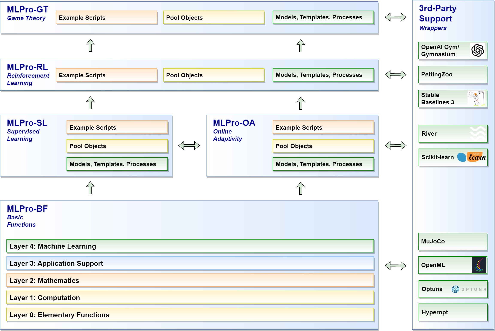

.. _target_mlpro_introduction:
Introduction
============

MLPro is a comprehensive and integrative middleware framework for standardized machine learning (ML) applications in Python.
The objective is to provide processes and templates for a wide range of relevant ML sub-areas without having to forego the use 
of already established and proven ML frameworks such as Scikit-learn, TensorFlow, PyTorch, Optuna, etc. Rather, the latter is 
seamlessly integrated into the process landscapes of MLPro. By using MLPro, researchers, developers, engineers, and students can 
focus on their essential core tasks without having to worry about the integration/interaction of different frameworks or 
having to re-implement existing algorithms. MLPro is architecturally designed for extensibility and recombinability, which in 
particular enables the creation of hybrid ML applications across different learning paradigms.

.. _target_key_features:
Key Features
------------
The most important key features of MLPro are...

   **1. Sub-Frameworks for various ML topics**
      - :ref:`MLPro-RL for Reinforcement Learning <target_mlpro_rl>`
      - :ref:`MLPro-GT for Game Theory <target_mlpro_gt>`
      - :ref:`MLPro-SL for Supervised Learning <target_mlpro_sl>`
      - :ref:`MLPro-OA for Online Adaptivity <target_mlpro_oa>`

   **2. Powerful substructure of overarching basic functions** 
      - :ref:`MLPro-BF for Basic Functions<target_mlpro_bf>`

   **3. Extensive pool of examples**
      - :ref:`Example Pool <target_appendix1>`

   **4. Integration of proven 3rd party packages**
      - :ref:`List of Wrappers <target_wrappers>`

   **5. Open source, open design**

Architecture
------------

MLPro consists of a continuously growing number of sub-frameworks covering different areas of machine learning.
These include one or more fundamental process models (e.g. the Markovian Decision Process in reinforcement learning) and
appropriate service and template classes. Furthermore, each sub-framework contains a specific pool of reusable classes for 
algorithms, data sources, training subjects, etc. Numerous sample programs for self-study complete the scope.

The sub-frameworks mentioned are in turn based on an overarching layer of basic functions. This is a common and obvious 
approach. What is special about MLPro, however, is the scope and internal structure of this base layer. 
A spectrum of elementary functions for logging and plotting through multitasking and numerics to the basics of machine 
learning is covered in a hierarchy of sub-layers that build on one another. This is also the key to the far-reaching 
recombinability of higher functions of MLPro. In fact, with each new feature, we consider how deeply we can incorporate 
it into MLPro. The deeper the level, the more universal the usability, and thus the range within MLPro.

Standardized Machine Learning
^^^^^^^^^^^^^^^^^^^^^^^^^^^^^
A special feature of MLPro is that machine learning standards are already defined in the basic functions. 
Templates for adaptive models and their hyperparameters as well as for executable ML scenarios are introduced 
in the top layer of MLPro-BF. Furthermore, standards for training and hyperparameter tuning are defined. These 
basic ML elements are reused and specifically extended in all higher sub-frameworks. On the one hand, 
this facilitates the creation of new sub-frameworks and, on the other hand, the recombination of higher functions 
from MLPro in your hybrid ML applications.

**Learn more:** :ref:`Basics of Machine Learning <target_bf_ml>`

Example Pool
^^^^^^^^^^^^

Numerous executable example programs (we call them "howtos") illustrate the essential functions of MLPro.
They are also used for validation and are therefore an integral part of our automatic unit tests.
With this, we ensure two things: the operability of all howtos and thus also the operability of the 
demonstrated functionalities (tdd - test-driven development).

**Learn more:** :ref:`Example Pool <target_appendix1>`

Third Party Support
^^^^^^^^^^^^^^^^^^^

MLPro integrates an increasing number of selected ML packages into its process landscapes.
This is done at different levels of MLPro using so-called wrapper classes that are compatible with 
the corresponding MLPro classes.

**Learn more:** :ref:`Wrappers <target_wrappers>`

Real-World Applications in Focus
^^^^^^^^^^^^^^^^^^^^^^^^^^^^^^^^

MLPro was designed not only for simulations but for use in real-world applications. To this end, various 
basic functions have been implemented that make diagnostics easier and make optimal use of the 
available system resources. These are for example

- Detailed logging
- Precise time management of simulated and real processes on a microsecond time scale
- Creation of detailed training data files (ASCII/CSV)
- Multithreading/multiprocessing 

In addition, powerful templates for state-based systems are provided. They allow the standardized implementation 
of your systems, which can then be controlled, for example, by adaptive controllers based on reinforcement 
learning or game theory. Furthermore, a wrapper for the popular physics engine `MuJoCo <https://mujoco.org/>`_ is 
provided, which can be used for the simulation and visualization of externally designed system models. The MLPro 
templates are also prepared for connection to industrial components like controllers, sensors, and actuators.

**Learn more:** :ref:`Elementary Functions <target_bf_elementary>`, :ref:`Computation <target_bf_computation>`, :ref:`State-based Systems <target_bf_systems>`

Development
-----------
MLPro is developed at the `South Westphalia University of Applied Sciences, Germany <https://www.fh-swf.de/en/international_3/index.php>`_ in the 
`Department for Electrical Power Engineering <https://www.fh-swf.de/en/ueber_uns/standorte_4/soest_4/fb_eet/index.php>`_ in the `Lab 
for Automation Technology and Learning Systems <https://www.fh-swf.de/en/forschung___transfer_4/labore_3/labs/labor_fuer_automatisierungstechnik__soest_1/standardseite_57.php>`_ 
and is therefore freely available to all interested users from research and development as well as industry and economy.

The development team consistently applies the following principles:

   * Quality first
      We aim to provide ML functionalities at the highest possible level. We put these up for discussion in scientific :ref:`publications <target_publications>`. 
      Open feedback and suggestions for improvement are always welcome.

   * Design first
      In MLPro, new functions are not created in the code editor but in a class diagram. We provide the latter in the 
      :ref:`API Reference <target_appendix2>`. A colour system documents the respective development status.

   * Clean Code Paradigm
      We firmly believe that a clearly structured and legible source code has a significant influence on both the acceptance and the life 
      cycle of software. Anyone who opens any source code of MLPro knows immediately what we mean :-)
