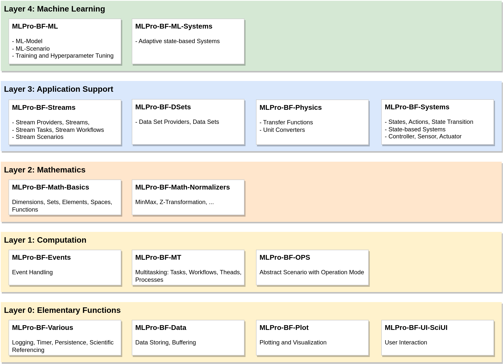

Overview
========

MLPro has an extensive substructure of comprehensive basic functionalities, which are combined in the sub-framework MLPro-BF. 
This is organized in a total of five layers that build on one another, as shown in the following figure:

The lowest :ref:`Layer 0: Elementary Functions <target_bf_elementary>` provides a collection of functions for logging, 
time measurement in simulated or real processes, data management/plotting, etc. It also contains a framework for interactive
GUI applications.

The next :ref:`Layer 1: Computation <target_bf_computation>` consists of various functionalities related to computation 
topics, such as event handling and multitasking. Furthermore, it introduces an abstract runtime scenario with an operation 
mode (simulation or real operation). This is one of the key concepts in MLPro to support real applications. It is reused 
and specialized at higher levels.

On top of this, :ref:`Layer 2: Mathematics <target_bf_mathematics>` introduces elementary mathematical objects like
dimensions, sets and elements, metric spaces, and functions. Furthermore, numeric algorithms for data normalization etc.
are included.

:ref:`Layer 3: Application Support <target_bf_application_support>` prepares the connection to real 
applications. It introduces powerful systematics for stream data processing/visualization and state-based systems that 
are, in turn, prepared for communication with real hardware components like sensors and actuators.

The top :ref:`Layer 4: Machine Learning <target_bf_ml>` of MLPro-BF specifies fundamental standards for machine learning. 
All higher ML-related sub-frameworks reuse and specialize them. Topics like hyperparameters, adaptive models, and their training 
and tuning in ML scenarios are handled here.