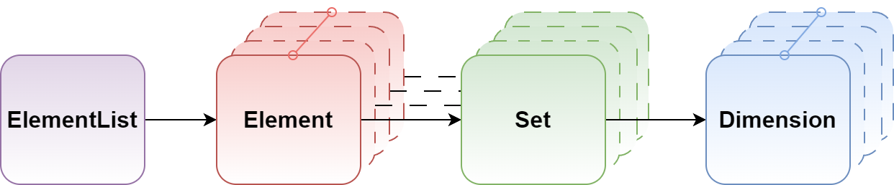

.. _target_bf_mathematics:
Layer 2 - Mathematics
=====================

Mathematics is an integral part of many areas, particularly in the fields of data analysis, machine learning, and system simulation.
MLPro-BF-MATH provides the basic functions of mathematics, which become the foundation for various computational tasks.
The basic functions of mathematics simplify the users of defining, conserving, and processing numeric data at a low level.

First, four main components are introduced in MLPro-BF-MATH to define a bunch of numeric data, such as:

   a) **Dimension**

      An object specifies properties of a dimension, including the name, the unit, the data type, the boundaries, and many more.
      Dimension in MLPro is not limited to real, natural, and integer numbers, but can also handle a big data object (e.g. images, point cloud, etc.).

   b) **Set**

      Set is a collection of dimensions that can also be described as a multivariate set in a mathematical sense.
      There are interesting functionalities, for instance, adding a new dimension to the set, getting information on the actual dimension in the set, and spawning a new object with a subset of dimensions.

   c) **Element**

      Element of a multivariate set. Each element represents a set, where the values of each component (Dimension object) can now be set.

   d) **ElementList**

      ElementList consists of a list of Element objects.

Second, MLPro also provides two objects to measure the distance between two elements, such as **MSpace** and **ESpace**.
**MSpace** represents a metric space. The distance calculation is based on the metric of the space.
**ESpace** represents a Euclidean space. The distance calculation is based on the Euclidean norm.

Third, MLPro has a **Function** class with mapping functionality.
This class is intended for an elementary bi-multivariate mathematical function that maps elements of a multivariate input space to elements of a multivariate output space.
With this class, it is possible to map a multivariate abscissa/input element to a multivariate ordinate/output element.

Lastly, there are more advanced functions of mathematics, as follows:

.. toctree::
   :maxdepth: 1

   layer2_mathematics/normalizers.rst

**Cross Reference**
    + :ref:`API Reference <target_ap_bf_math>`
    + :ref:`Howto BF-MATH-001: Dimensions, Spaces and Elements <Howto BF MATH 001>`