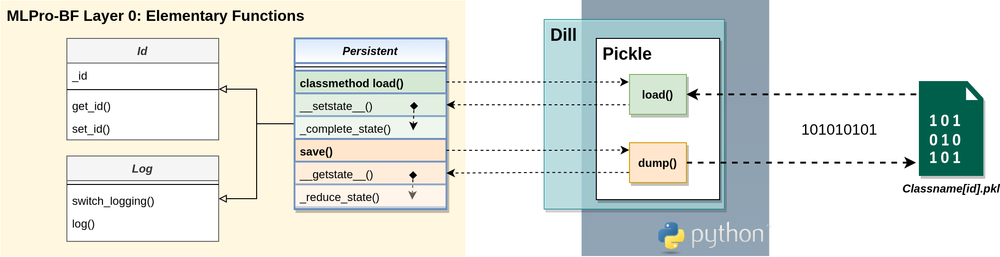

.. _target_bf_persistence:
Persistence
===========

MLPro already introduces the property class **Persistent** on the lowest level of its basic functions. This class
provides the two public methods **load()** and **save()** for loading and saving objects as files. As usual in Python, 
the standard module **pickle** is internally used for de-/serialization. More specifically, the **dill** extension 
is used, which extends **pickle's** scope of natively serializable data types. Actually, neither **pickle** nor **dill** can 
natively serialize all types of data. For example, third-party packages such as Pygame, PyTorch, or MuJoCo provide 
data structures that cannot be natively serialized with **pickle/dill**. In order to be able to use such non-serializable 
data objects in a consistent persistence strategy, the Python standard offers the two custom methods

.. code-block:: python
    
    __setstate__(self, state:dict)

and

.. code-block:: python
    
    __getstate__(self) -> dict

Classes that implement these methods can exclude non-serializable content from de-/serialization process and handle it appropriately.
The **Persistent** class implements both of these methods and defines two new custom methods 

.. code-block:: python
    
    _complete_state(self, p_path:str, p_os_sep:str, p_filename_stub:str)

and

.. code-block:: python
    
    _reduce_state(self, p_state:dict, p_path:str, p_os_sep:str, p_filename_stub:str)

These, in turn, provide the correct file path and a standard file name (without an extension, hence "stub") to ensure the
integrity of all files related to the object. The file name is generated and consists of the name of the class and the 
unique ID of the object to be de-/serialized. The figure below shows the correlations between the Python standard module 
**pickle**, it's extension **dill** and MLPro's class **Persistent**:

**Saving Objects**

Saving an object works basically like this:

.. code-block:: python

    from mlpro.bf.various import Persistent

    class MyClass (Persistent): 

        def _complete_state(self, p_path:str, p_os_sep:str, p_filename_stub:str):
            """
            To be called by Python standard method __setstate__() during deserialization...
            """
            pass

        def _reduce_state(self, p_state:dict, p_path:str, p_os_sep:str, p_filename_stub:str):
            """
            To be called by Python standard method __getstate__() during serialization...
            """
            pass

    
    mc = MyClass()
    mc.save( p_path='c:\tmp')

If the file name itself is omitted from the **save()** method, MLPro generates a default file name as previously described. 
For example:

.. code-block:: python

    MyClass[8aa41da2-0748-4cd0-9025-55e9d9d9a131].pkl 

In the custom method **_reduce_state()**, non-serializable parts of MyClass can now be saved in other files with the same name 
and directory but specific file extension, such as 

.. code-block:: python

    MyClass[8aa41da2-0748-4cd0-9025-55e9d9d9a131].csv 

**Loading Objects**

The **load()** method of the **Persistent** class is defined as a class method because a related object 
is only generated by loading. So it's essential to know which class is used to load a previously saved file:

.. code-block:: python

    mc = MyClass.load( p_path='c:\tmp', p_filename='MyClass[8aa41da2-0748-4cd0-9025-55e9d9d9a131].csv')

In this case, the custom method **_complete_state()** of class **MyClass** is used to automatically load additional 
content into the object.

**Version of Persistence**

The **Persistent** class also contains a class attribute 

.. code-block:: python

    C_PERSISTENCE_VERSION : str = '1.0.0'

that labels the current implementation of persistence with a unique version. The **load()** method compares the version 
of the loading class and the object to be loaded and denies file access if the versions differ. 

.. note::
    The version of a child class of **Persistent** should be increased in case of incompatible changes on the 
    methods **_complete_state(**) or **_reduce_state()**.

    
**Cross Reference**

- :ref:`Howto BF-005: Persistence <Howto BF 005>`
- :ref:`API Reference BF-VARIOUS - Various Functions <target_api_bf_various>`
- `Python Documentation: Python object serialization <https://docs.python.org/3/library/pickle.html#>`_
- `Python Documentation: Persistence of external objects <https://docs.python.org/3/library/pickle.html#persistence-of-external-objects>`_
- `Dill: Python extension for pickle <https://pypi.org/project/dill/>`_
