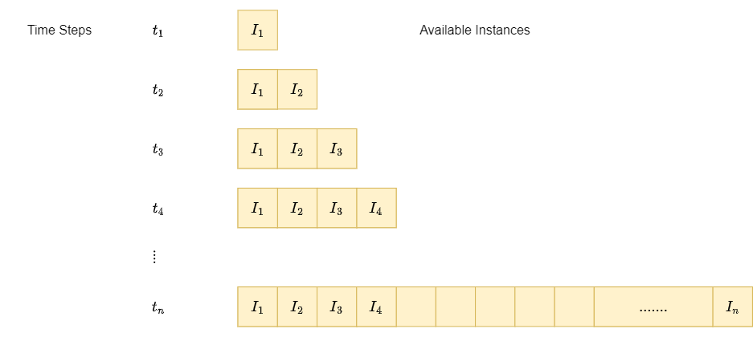
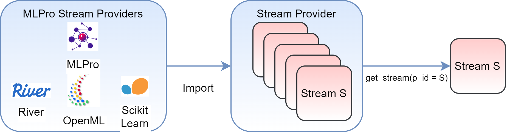

.. _target_streams_intro:
Streams
=======

A data stream is a live data source that delivers instances sequentially. Unlike offline datasets, data
instances cannot be scanned on demand in case of streams. Data instances are only available at the order they
arrive. For example, think of a live RADIO signal that delivers new data with time, however, complete access to entire
data is not possible.

As shown in the figure above, at every timestep, new information is available. However, the number of instances
delivered at each instance and availability of historical instances depends on the type of stream and the processing
task respectively.

In industrial scenarios, with more and more complex systems the amount of live data delivered by the systems increases
rapidly. This high amount of live data can be leveraged to take optimal decisions for processes. This real-time data
is a data stream because of its live nature and processing such real-time data is a relevant field of data-mining
and machine learning known as Stream Processing and Online Machine Learning respectively.

Streams Handling
----------------

MLPro's stream module provides a stream handling and bundle of stream processing functionalities. The
stream handling architecture in MLPro is as shown in the following figure:

The figure shows a collection of stream provider apis, which in turn, contain a list of corresponding stream objects.
Currently, MLPro supports stream provider api for MLPro's native streams and three external data providers:

    - OpenML
    - River
    - Scikit-Learn

Stream Provider
---------------
Access to real-time data stream is not always possible for the purpose of testing and evaluations. MLPro's streams
module provides Stream Provider functionality. A stream provider in MLPro is a data resource that provides stream
objects for various operations.

MLPro's streams module provides native stream providers, that generate stream objects with user-defined parameters
such as number of features and labels and pre-defined statistical properties such as feature boundaries. Currently
MLPro's native stream provider supports random streams with random feature and label values. Along with native stream
provider MLPro also supports data resources from popular external data resources including OpenML, ScikitLearn and
River. MLPro's stream provider object accesses datasets from these resources and provide them as stream
objects that imitate the sequential behaviour.

A stream provider in MLPro can be imported by including:

.. code-block:: python

    # import mlpro native stream provider
    from mlpro.bf.streams.native import NativeStreamProvider
    # import openml stream provider
    from mlpro.wrappers.openml import WrOpenMLStreamProvider
    # import river stream provider
    from mlpro.wrappers.river import WrRiverStreamProvider
    # import scikit learn stream provider
    from mlpro.wrappers.sklearn import WrSKLearnStreamProvider

After loading the stream provider (MLPro's native stream provider for example), the list of available streams can be
loaded as following:

.. code-block:: python

    # Import the stream provider class
    from mlpro.bf.streams.native import NativeStreamProvider
    # Create an object of the stream provider
    mlpro = NativeStreamProvider()
    # Get a list of streams
    mlpro.get_stream_list()

Stream
------
In MLPro, a stream is a special iterator object that delivers new data instances with each iteration. A stream cannot be
read directly for all the instances, instead an instance is only available when requested by a workflow. An instance
in MLPro consists of feature and label data for that specific instance.

From a stream provider a specific stream of interest can be accessed with a stream id:

.. code-block:: python

    mystreamobject = mlpro.get_stream(p_id = '1')

After accessing the stream from the stream provider, a new instance can be accessed from the data stream by iterating
over it.

Stream Instance
---------------

An instance in MLPro is a data element available at each time step, when processing a stream. An instance consists of
a unique id, feature data and label data.

.. code-block:: python

    # Accessing an instance from stream
    instance = next(iter(mystreamobject))

    # Accessing the stream ID
    id = instance.get_id()

    # Accessing feature data
    feature_element = instance.get_feature_data()
    feature_data = feature_element.get_values()

    # Accessing label data
    label_element = instance.get_label_data()
    label_data = label_element.get_values()

.. note::
    - The ids of the stream instances are managed internally by a Stream Workflow, and are also used for stream plotting functionalities. Changing instance ids might affect the performance of stream functionalities of MLPro.

**Cross Reference**

+ :ref:`API Reference: Streams <target_api_bf_streams>`
+ :ref:`Tutorial: How To Bf - Streams 101 <Howto BF STREAMS 101>`