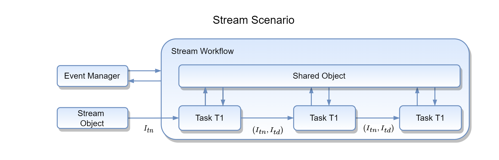

Stream Processing
=================
Handling streaming data sources and mining knowledge from them requires special types of processing tasks because of
their live behaviour. Stream operations process new instances as they are available at every step. Along with a
number of external and internal stream resources, MLPro's stream module provides processing functionalities
like sliding window, rearranger, etc. specialized for streaming data.

In MLPro, streaming data is processed with a task and workflow architecture. A StreamTask is single operation
performed on new stream instances and a StreamWorkflow is a list of tasks arranged sequentially with defined
dependencies. StreamTask and StreamWorkflows are specialized classes inherited from MLPro's multiprocessing module.
As shown in the above figure the scenario fetches new :math:`I_{tn}` instances from the stream object and each task
then processes a list of new instances :math:`I_{tn}` and deleted/obsolete instances :math:`I_{td}` as shown in the
figure. The processed instances are stored in the shared object for further accessibility.

Know more about stream handling in MLPro:

.. toctree::

    streams_processing/stream_processing.rst

**Cross References**

+ :ref:`Howto BF-STREAMS-102: Tasks Workflows And Stream Scenarios <Howto BF STREAMS 102>`
+ :ref:`API Reference: Streams <target_ap_bf_streams>`
