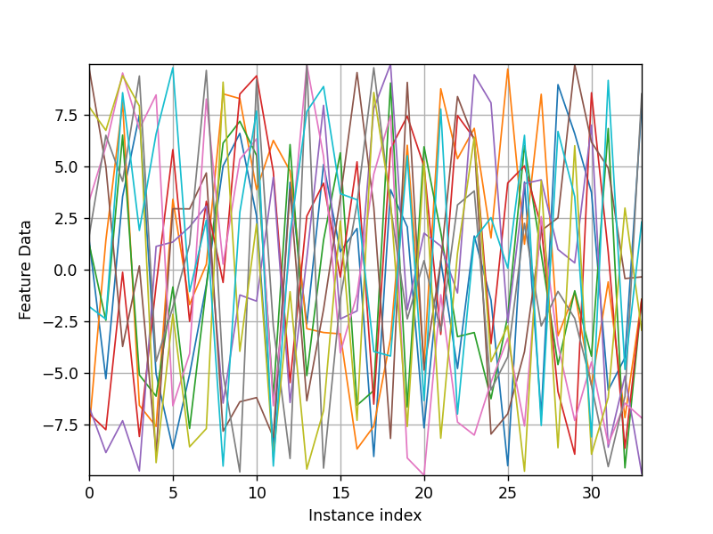
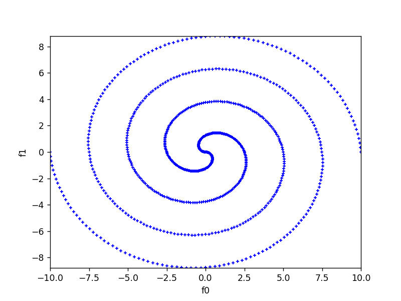
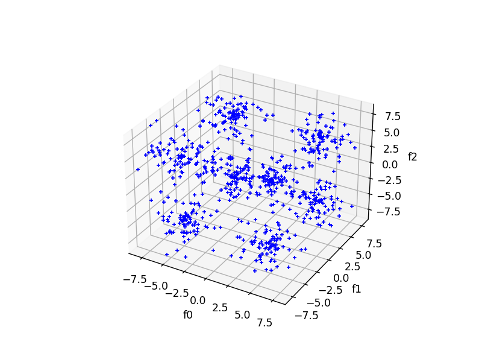
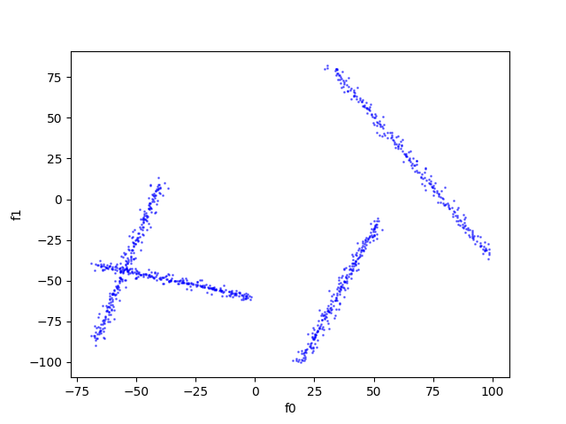
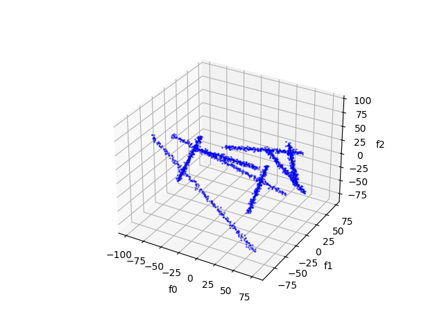

.. _target_bf_streams_native_streams_pool:
Native Streams
==============

Along with third party stream support, MLPro also provides pool of native stream objects. The native streams in MLPro
include the following implementations.

Cross Reference:
 + :ref:`Howto BF-STREAMS-001: Accessing Native Data From MLPro <Howto_BF_ZZ_999>`
 + :ref:`Howto BF-STREAMS-002: Accessing Data From CSV Files <Howto_BF_STREAMS_002>`
 + :ref:`API Reference: Streams <target_ap_bf_streams>`

Random 10 Dimensional
---------------------
.. automodule:: mlpro.bf.streams.streams.rnd10d

Double Spiral 2D
----------------
.. automodule:: mlpro.bf.streams.streams.doublespiral2d

Static Clouds 2D
----------------
.. automodule:: mlpro.bf.streams.streams.clouds2d_static

.. image::
    images/static_cloud_2d.png
    :width: 600px

Static Clouds 3D
----------------
.. automodule:: mlpro.bf.streams.streams.clouds3d_static

Data from CSV Files
--------------------
.. automodule:: mlpro.bf.streams.streams.csv_file

.. image::
    images/csv_files.png
    :width: 600px

Dynamic Clouds 2D
----------------
.. automodule:: mlpro.bf.streams.streams.clouds2d_dynamic

Dynamic Clouds 3D
----------------
.. automodule:: mlpro.bf.streams.streams.clouds3d_dynamic

    