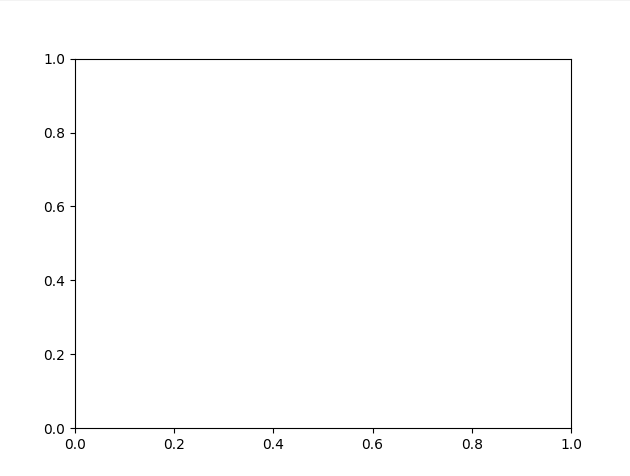
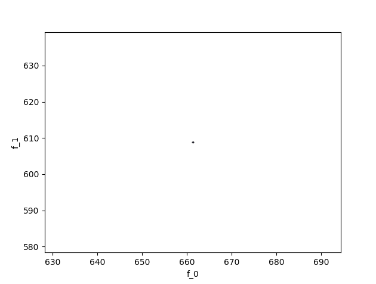

Random Point Clouds (2D, 3D, ND), Static or Dynamic
---------------------------------------------------
.. automodule:: mlpro.bf.streams.streams.clouds

2D random clouds...

3D random clouds...

.. image::
    images/cloud03.gif
    :width: 400px

.. image::
    images/cloud04.gif
    :width: 400px

.. image::
    images/cloud05.gif
    :width: 400px

**Cross Reference**
   - :ref:`Howto BF-STREAMS-006: Visualizing Static 2D Random Point Clouds Provided By MLPro <Howto_BF_STREAMS_006>`
   - :ref:`Howto BF-STREAMS-007: Visualizing Dynamic 2D Random Point Clouds Provided By MLPro <Howto_BF_STREAMS_007>`
   - :ref:`Howto BF-STREAMS-008: Visualizing Static 3D Random Point Clouds Provided By MLPro <Howto_BF_STREAMS_008>`
   - :ref:`Howto BF-STREAMS-009: Visualizing Dynamic 3D Random Point Clouds Provided By MLPro <Howto_BF_STREAMS_009>`
   - :ref:`Howto BF-STREAMS-010: Visualizing Multivariate Random Cloud Generator in 3D Mode Provided By MLPro <Howto_BF_STREAMS_010>`
