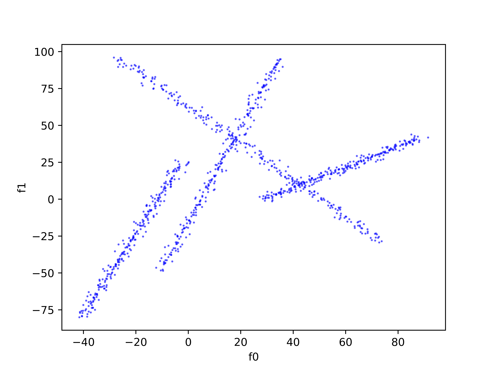

Dynamic Clouds 2D
----------------
.. automodule:: mlpro.bf.streams.streams.clouds2d_dynamic

**Cross References**

 + :ref:`Howto BF-STREAMS-003: Visualize Moving 2D Clouds Provided By MLPro <Howto_BF_STREAMS_003>`