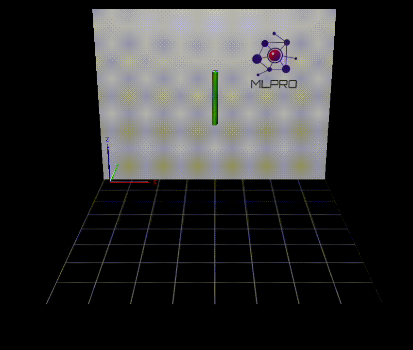

.. _target_bf_systems_mujoco:
MuJoCo Integration
==================

|pic1| |pic2|

.. |pic1| image:: images/mujoco_cartpole.gif
   :width: 20%

MuJoCo is a well-known physics engine for its fast and accurate simulation. The aim is to facilitate research and development in robotics, biomechanics, graphics 
and animation, and other areas. More explanation about MuJoCo can be found in `here <https://mujoco.org/>`_.

In order to use the MuJoCo integration in MLPro, the following steps need to be done:

    * **Create a MuJoCo Model**

        Create a MuJoCo model file accordingly to your design. Some example model are published by MuJoCo and can be accessed `here <https://mujoco.readthedocs.io/en/latest/models.html>`_.
        Below is an example of MuJoCo model file.

        .. code-block:: xml

            <mujoco>
              <option timestep="0.05" gravity="0 0 -9.81" integrator="RK4">
                <flag sensornoise="enable" energy="enable"/>
              </option>
              <worldbody>
                    <light diffuse=".5 .5 .5" pos="0 0 3" dir="0 0 -1"/>
                <geom type="plane" size="1 1 0.1" rgba=".9 0 0 1"/>

                <body name="link1" pos="0 0 2" euler="0 0 0">
                  <joint name="pin" type="hinge" axis = "0 -1 0" pos="0 0 0.5"/>
                  <inertial pos="0 0 0" mass="1" diaginertia="1 1 1" />
                  <geom type="cylinder" size="0.05 0.5" rgba="0 .9 0 1"/>
                </body>
                
              </worldbody>

              <actuator>
                <motor joint="pin" name="torque1" gear="1" ctrllimited="true" ctrlrange="-50 50"/>
              </actuator>
            </mujoco>

        The above model simulates one body called ``link1`` which has a cylindrical shape. It is attached to the world body with a joint called ``pin`` 
        with the type of hinge. This joint is controlled by an actuator called ``torque1`` boundaries between -50 and 50.

    * **Create a System**

        When you instantiate the System, put the MuJoCo model file path on ``p_mujoco_file``.
        If the model is correct and the path is correct, then the wrapper will automatically wrap the state and action space based on the MuJoCo model.
        
If you want to view your model only before including it in MLPro, you can use the MuJoCo tool by dragging and dropping the model file into it. The tool 
can be downloaded `here <https://github.com/deepmind/mujoco/releases>`_.

**Cross Reference**

- `MuJoCo Tool <https://github.com/deepmind/mujoco/releases>`_
- `MuJoCo XML Reference <https://mujoco.readthedocs.io/en/stable/XMLreference.html>`_
- `MuJoCo Model Samples <https://mujoco.readthedocs.io/en/latest/models.html>`_
- `Unity Plug-in for MuJoCo <https://mujoco.readthedocs.io/en/stable/unity.html>`_
- :ref:`MuJoCo Wrapper <Wrapper MuJoCo>`
- :ref:`Howto BF-SYSTEMS-002: Double Pendulum Systems wrapped with MuJoCo <Howto BF SYSTEMS 002>`
- :ref:`Howto BF-SYSTEMS-003: Cartpole Continuous Systems wrapped with MuJoCo <Howto BF SYSTEMS 003>`
- :ref:`Howto RL-AGENT-021: Train and Reload Single Agent Cartpole Discrete (MuJoCo) <Howto Agent RL 021>`
- :ref:`Howto RL-AGENT-022: Train and Reload Single Agent Cartpole Continuous (MuJoCo) <Howto Agent RL 022>`
- :ref:`Howto RL-ATT-002: Train and Reload Single Agent using Stagnation Detection Cartpole Discrete (MuJoCo) <Howto RL ATT 002>`
- :ref:`Howto RL-ATT-003: Train and Reload Single Agent using Stagnation Detection Cartpole Continuous (MuJoCo) <Howto RL ATT 003>`
- :ref:`Howto RL-ENV-005: Run Agent with random policy on double pendulum mujoco environment <Howto Env RL 005>`
