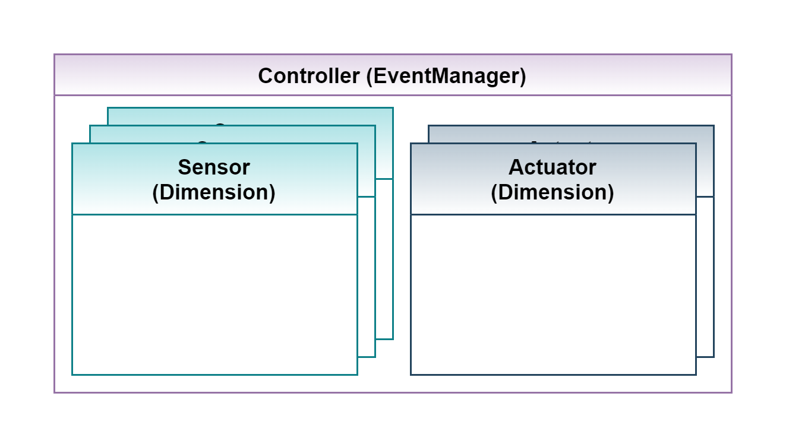

.. _target_bf_systems_hardware:
Hardware Access
===============

MLPro also provides possibility to use the standardized Systems API with real world systems. It manages the
interaction between real world hardware including sensors, actuators and controllers with the standard processes in
MLPro framework.

As shown in the above figure, the controller class in MLPro registers a number of sensors and actuators for a system.

1. **Sensor**:

    A sensor observes a system to deliver characteristic information about the system at a given time. The Sensor class in MLPro inherits from the Dimension class.

2. **Actuator**:

    An actuator is responsible to generate an Action, which is executed in the real world system. Similar to Sensor class, the Actuator class is also inherited from the Dimension class of MLPro.

3. **Controller**:

    The controller is responsible to gather sensor data, compute the error signal and generate a corresponding action in order to maintain/reach the desired state of the system. The Controller class in MLPro manages the mapping details to map actions and states, to and from Actuators and Sensors, respectively.

**Cross Reference**

- :ref:`API Reference BF-Systems <target_ap_bf_systems>`
- :ref:`Howto BF-SYSTEMS-001: System, Controller, Actuator, Sensor <Howto BF SYSTEMS 001>`
