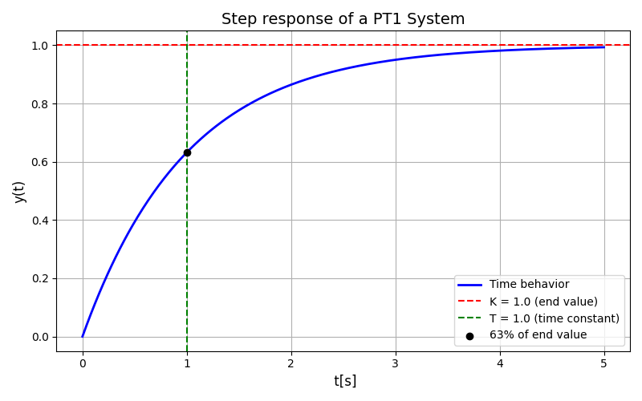

.. _target_bf_systems_03:
PT1 System
==========

A **PT1 system** (Proportional-Time-Lag system of first order) is a simple dynamic system used to model processes that exhibit a time delay in their response. It is commonly encountered in electrical, thermal, mechanical, and other physical systems where the output changes gradually in response to an input.

Transfer Function of a PT1 System
---------------------------------

The transfer function of a PT1 system in the Laplace domain is:

.. math::

   G(s) = \frac{K}{T \cdot s + 1}

Where:
- **\(K\):** Gain factor (amplifies the output signal relative to the input signal).  
- **\(T\):** Time constant (characterizes how quickly the system responds to input changes).  
- **\(s\):** Complex frequency variable from the Laplace transformation.

Time Behavior of a PT1 System
-----------------------------

The time behavior of a PT1 system can be analyzed using its **step response**, which describes how the output changes over time when the input is a step function.

1. **Step Response:**
   The output rises gradually and asymptotically approaches its final value. The response is characterized by the time constant (T):
   - At (t = T), the output reaches approximately 63% of its final value.
   - At (t = 3T), the output is about 95% of the final value.

   The step response is described mathematically as:

   .. math::

      y(t) = K \cdot \left(1 - e^{-\frac{t}{T}}\right)

2. **Time Constant (T):**
   - A smaller \(T\) means the system responds faster.
   - A larger \(T\) means the system responds more slowly.

Frequency Response of a PT1 System
----------------------------------

- At **low frequencies**, the output amplitude is close to the input amplitude (\(K\)).
- At **high frequencies**, the output amplitude decreases significantly, and the system acts as a low-pass filter.

Applications of PT1 Systems
---------------------------

PT1 systems are widely used to model simple processes, such as:

- **Electrical circuits**: RC circuits where the resistor-capacitor combination creates a first-order response.
- **Thermal systems**: Temperature control systems where heat transfer is slow.
- **Hydraulic systems**: Systems with a simple delay in flow or pressure changes.
- **Mechanical systems**: Systems with inertia or damping where the response follows a first-order dynamic.

Advantages and Limitations
---------------------------

**Advantages:**
- Simple to analyze and model.
- Suitable for many practical systems with first-order dynamics.

**Limitations:**
- Cannot model oscillatory or higher-order behavior.
- Limited to systems where the response is exponential and without overshoot.

**PT1 system can be imported and used as following:**

.. code-block:: python

    #import PT1  model
    from mlpro.bf.systems.pool import PT1

    #create a PT1 object
    my_ctrl_sys = PT1( p_K = pt1_K,
                    p_T = pt1_T,
                    p_sys_num = 0,
                    p_y_start = 0,
                    p_latency = timedelta( seconds = cycle_time),
                    p_visualize = visualize,
                    p_logging = logging )

**Cross Reference**

- :ref:`Howto BF-CONTROL-101: PID-Controller with PT1 system <Howto_BF_CONTROL_101>`

- :ref:`API References <target_api_bf_systems_pool_pt1_system>`

- `Further information <https://www.circuitbread.com/tutorials/first-order-systems-2-2>`_

