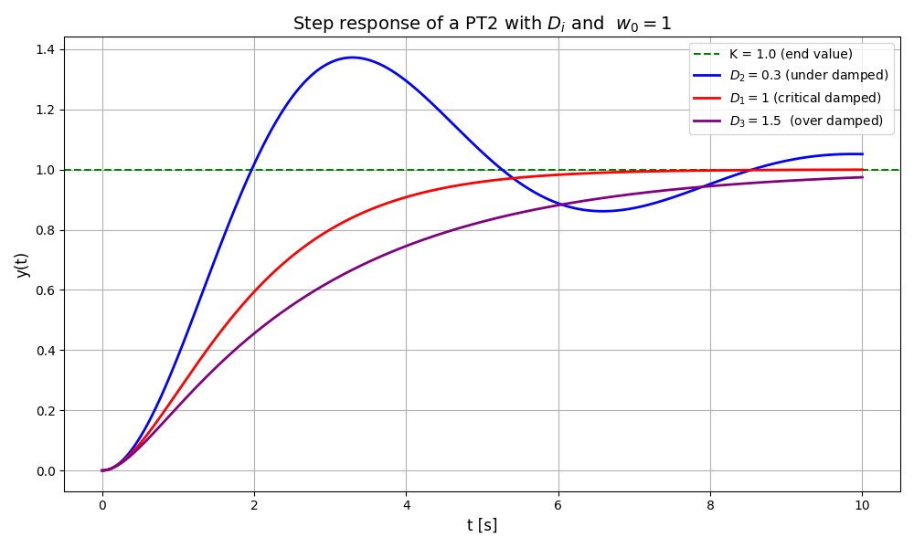

.. _target_bf_systems_04:
PT2 System
==========

A **PT2 system** (Proportional-Time-Lag system of second order) is a dynamic system characterized by a second-order differential equation. It models processes with more complex dynamics, such as oscillations or underdamped responses, which occur in many mechanical, electrical, or hydraulic systems.

Transfer Function of a PT2 System
---------------------------------

The transfer function of a PT2 system in the Laplace domain is:

.. math::

   G(s) = \frac{K}{T^2 \cdot s^2 + 2 \cdot D \cdot T \cdot s + 1}

Where:
- **\(K\):** Gain factor (amplifies the output signal relative to the input signal).  
- **\(T\):** Time constant (characterizes the speed of the system).  
- **\(D\):** Damping factor (indicates how oscillatory the system is).  
- **\(s\):** Complex frequency variable from the Laplace transformation.

Time Behavior of a PT2 System
-----------------------------

The behavior of a PT2 system depends heavily on the **damping factor (\(D\))**:

1. **Underdamped (D < 1):**
   - The system exhibits oscillations around the final value before settling.
   - The smaller \(D\), the more pronounced the oscillations.

2. **Critically damped (D = 1):**
   - The system reaches the final value as quickly as possible without overshooting.

3. **Overdamped (D > 1):**
   - The system reaches the final value slowly, without oscillations.

Mathematically, the step response of a PT2 system can be expressed using exponential and oscillatory terms depending on (D).

Key Properties of PT2 Systems
-----------------------------

1. **Damping Factor (D):**
   - Determines whether the system is underdamped, critically damped, or overdamped.
   - For example, (D = 0.7) is commonly used in control systems to balance response speed and overshoot.

2. **Natural Frequency (omega_0):**
   - The undamped natural frequency is defined as:

     .. math::

        \omega_0 = \frac{1}{T}

     - Describes how fast the system oscillates in the absence of damping.

Frequency Response of PT2 Systems
---------------------------------

- At low frequencies, the system behaves similarly to a gain (K).
- At higher frequencies, the output amplitude decreases significantly.
- If (D < 1), there is a **resonance peak** at a specific frequency (omega_{\text{res}}) where the system amplifies certain frequencies.

Applications of PT2 Systems
---------------------------

PT2 systems are used to model and analyze various processes, such as:

- **Mechanical systems**: Mass-spring-damper components.
- **Electrical circuits**: Oscillatory RLC circuits.
- **Hydraulic systems**: Systems with inertia and damping.
- **Control systems**: Basic models for more advanced controllers with second-order dynamics.

Advantages and Limitations
---------------------------

**Advantages:**
- Can model oscillatory and complex dynamic behaviors.
- Useful for systems with higher-order dynamics.

**Limitations:**
- More complex to analyze and control than PT1 systems.
- Requires more precise tuning in control applications, especially for underdamped systems.

**PT2 system can be imported and used as following:**

.. code-block:: python

    #import PT2  model
    from mlpro.bf.systems.pool import PT2

    #create a PT1 object
    my_ctrl_sys = PT2(  
                    p_K = pt2_K,
                    p_D = pt2_D,
                    p_omega_0 = pt2_w_0,
                    p_sys_num = 1,
                    p_max_cycle = cycle_limit,
                    p_latency = timedelta( seconds = cycle_time ),
                    p_visualize = visualize,
                    p_logging = logging )

**Cross Reference**

- :ref:`Howto BF-CONTROL-102: PID-Controller with PT2 system <Howto_BF_CONTROL_102>`

- :ref:`API References <target_api_bf_systems_pool_pt2_system>`

- `Further information <https://www.circuitbread.com/tutorials/second-order-systems-2-3>`_
