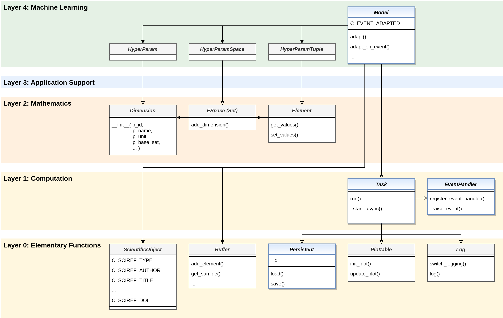

.. _target_bf_ml_model:
The Adaptive Model
==================

MLPro provides the central template class **Model** for adaptive models. This bundles all 
properties important for machine learning on an abstract level. It represents the basis for 
all higher adaptive classes of the entire MLPro ecosystem and inherits its essential properties 
and possibilities for application-specific adjustments to them.

Performant Execution
--------------------

As shown above, the Model class is made up of numerous base classes of the lower levels through 
inheritance. So, from :ref:`Layer 1 - Computation <target_bf_computation>`, it inherits the executability 
and asynchronous processing capabilities of class **Task**. In this way, it can also be combined in 
workflows to (parallel/asynchronously) executable groups of models. From class **EventHandler** of the 
same level, it inherits the ability to raise events and forward them to registered event handlers. 

Persistency
-----------

In particular, from :ref:`Layer 0 - Elementary Functions <target_bf_elementary>`, it inherits the ability 
of the **LoadSave** class to be able to be saved and reloaded. Other elementary capabilities such as 
logging, visualization, buffering of sample data, and referencing a scientific source are also fed in from 
this lower level.

Adaptivity
----------

The Model class itself adds the ability to adapt. To this end, two mechanisms are introduced that support 
explicit adaptation based on external data and event-oriented adaptation. In both cases, the event 
**C_EVENT_ADAPTED** is raised, which can also be optionally handled as part of event handling. In this way, 
adaptation cascades can be triggered in a group of cooperating models.

Hyperparameters
---------------

Also, at the top layer 4 for machine learning, a system for hyperparameters is introduced and added to the 
Model class. These, in turn, take up the concepts of **Dimension**, **Set/Space**, and **Element** from 
:ref:`Layer 2 - Mathematics <target_bf_mathematics>`.

**Cross Reference**

- howto 1: simple custom model 
- howto 2: group of custom models in a workflow with random adaptation cascades
- :ref:`Models in Reinforcement Learning: Policy, Agent, MultiAgent <target_agents_RL>`
- :ref:`Models in Game Theory: Player, MultiPlayer <target_players_GT>`
- :ref:`API Reference MLPro-BF-ML <target_api_bf_ml>`
