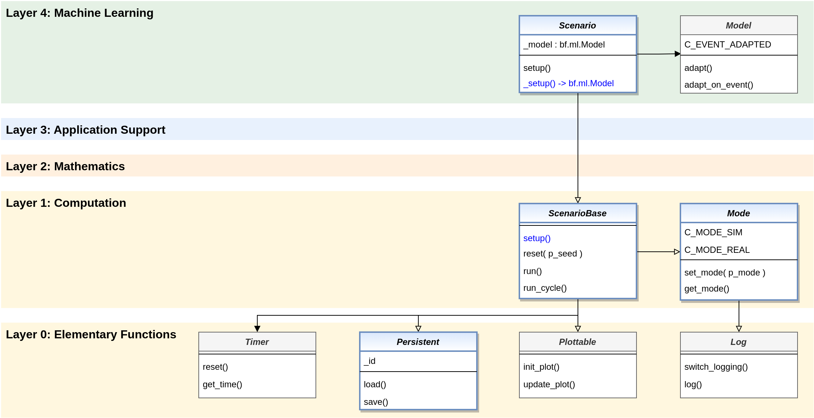

.. _target_bf_ml_scenario:
ML Scenarios
============

As already mentioned, adaptive models in MLPro are combined with their concrete context to form an ML scenario.
MLPro provides the abstract template class **bf.ml.Scenario** for this. At this level, this is not yet intended for use in 
your own customer applications, but is only used here to standardize the basic properties of an ML scenario.

From the root class of all scenarios in MLPro :ref:`bf.ops.ScenarioBase <target_bf_ops>` it inherits the following properties

- Operation mode (simulation or real operation)
- Execution of cycles
- Persistence
- Visualization

and adds at this level the management of an internal adaptive model.

**Cross Reference**

- :ref:`Class bf.ops.ScenarioBase <target_bf_ops>`
- :ref:`API Reference MLPro-BF-ML <target_api_bf_ml>`