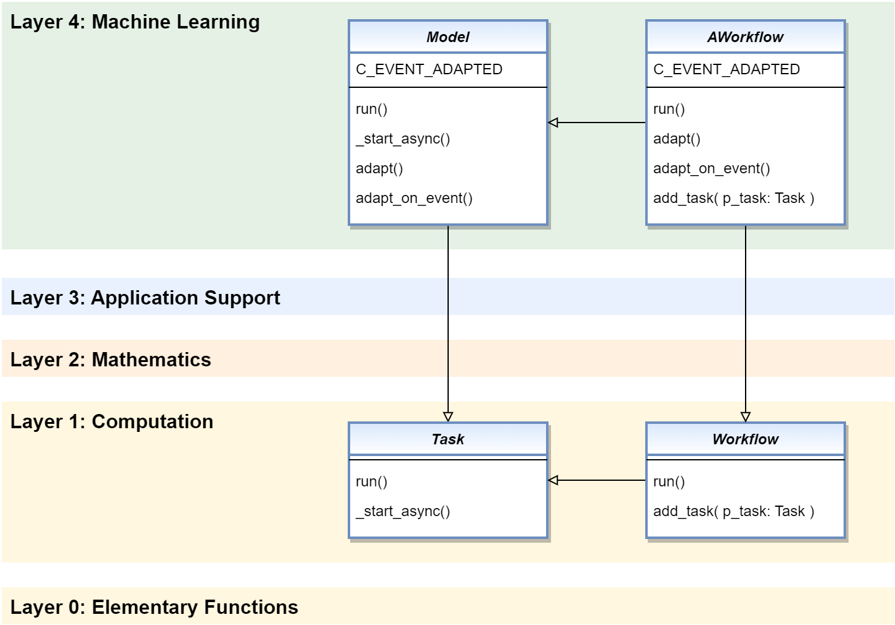

.. _target_bf_ml_workflows:
Adaptive Workflows
==================

The **Model** class inherits from the **bf.mt.Task** class, among others. In combination with 
another class **AWorkflow**, all possibilities of MLPro's multitasking abilities are unlocked
for machine learning:

**1. Models can execute internal methods asynchronously**

**2. Models can run as separate threads or processes**

**3. Models can be grouped into macro models in workflows**

**4. Models can share/exchange data using a shared object**

This enables the efficient execution and adaptation of models and model groups using all available
runtime resources.

**Cross Reference**

- :ref:`BF-MT: Multitasking <target_bf_mt>`