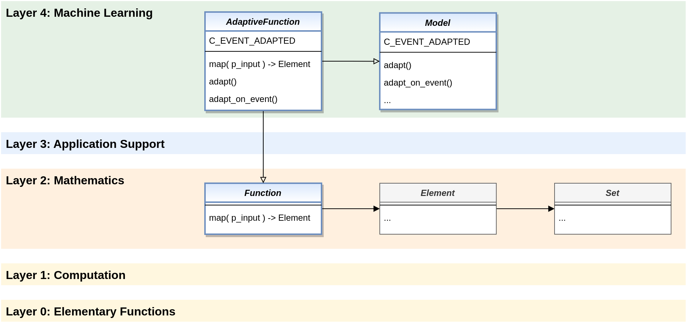

.. _target_bf_ml_afct:
Adaptive Functions
==================

A special kind of adaptive models are the **adaptive functions**. They combine the properties of a mathematical 
function with those of an adaptive model. The **class AdaptiveFunction** manifests and standardizes these functions 
without implementing concrete learning paradigms. The latter happens in higher MLPro frameworks, for example in 
MLPro-SL for offline/online supervised learning.

Adaptive functions have a high practical relevance. They are reused within MLPro, e.g. in connection with model-based 
agents. But they can also be used in general for predictions.

**Cross Reference**

- :ref:`BF-Math: Mathematics <target_bf_mathematics>`
- :ref:`SL: Adaptive Functions for Supervised Learning <target_bf_sl_afct>`
- :ref:`RL: Model-based Agents <target_agents_MBRL>`
