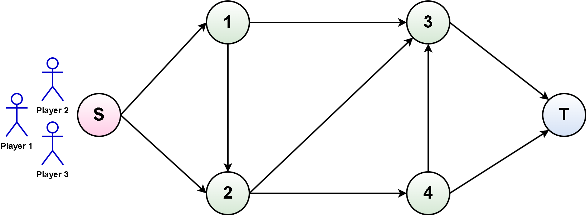
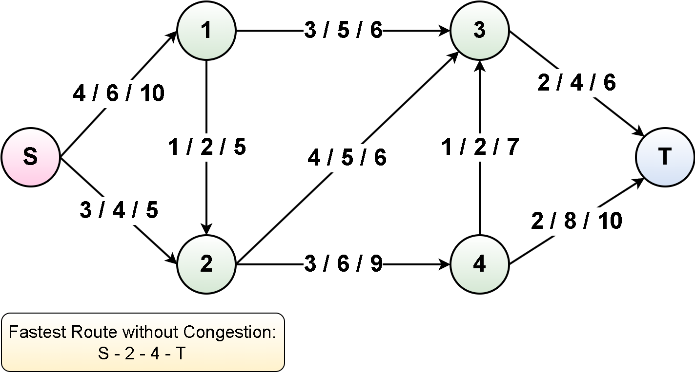

3P Routing Problems
^^^^^^^^^^^^^^^^^^^^^^^^^

**General Information**

In a 3-player routing problem with congestion in game theory, three entities or players navigate a network with multiple routes to reach their respective destinations.
Each player's objective is to minimize their travel time or cost, and the congestion on each route is a critical factor influenced by the collective decisions of all players.
This scenario is formalized as a congestion game, a type of non-cooperative game where individual players make decentralized decisions impacting overall congestion levels.

The network comprises various routes, each associated with a travel time or cost.
Importantly, the congestion on a route increases as more players opt for that specific path, leading to longer travel times or higher costs.
Players make independent decisions regarding their routes, aiming to optimize their individual utility based on minimizing travel time or cost.
The strategic considerations involve players weighing the congestion effects on different routes when making their decisions.

A Nash equilibrium, a key concept in game theory, is reached when no player has an incentive to unilaterally change their chosen route given the choices made by others.
At equilibrium, the congestion on each route stabilizes, and players find routes that collectively satisfy their individual optimization goals.

In this setting, players engage in strategic decision-making by considering the congestion levels on different routes.
They evaluate the trade-off between selecting a potentially faster yet more congested route against a longer but less congested alternative.
The social welfare of the system, reflecting overall efficiency, is influenced by the aggregate travel times or costs across all players and routes.

Analyzing 3-player routing problems with congestion involves exploring the strategic interactions among players, identifying potential Nash equilibria, and assessing the implications of individual decisions on the overall efficiency of the network.
Game theory serves as a valuable framework for understanding how decentralized decision-making in such scenarios can lead to equilibrium outcomes and how those outcomes impact network congestion dynamics.

In this game, we setup 3P routing problems with congestions, as follows:

The goal is to reach the target node from the starting node with the shortest pathway as possible and avoid congestions as much as possible.

This game can be imported, as follows:

.. code-block:: python

    from mlpro.gt.pool.native.games.routingproblems_3p import Routing_3P

**Player, Coalition, and Competition**

In the 3P Routing Problems games in MLPro-GT, we consider three players.
Each player has a set of strategies to be selected, as follows:

+------------------------------------+-------------------------------------------------------+
|           Strategy                 |                         Path                          |
+====================================+=======================================================+
| 1                                  | S -> 1 -> 2 -> 3 -> T                                 |
+------------------------------------+-------------------------------------------------------+
| 2                                  | S -> 1 -> 3 -> T                                      |
+------------------------------------+-------------------------------------------------------+
| 3                                  | S -> 1 -> 2 -> 4 -> 3 -> T                            |
+------------------------------------+-------------------------------------------------------+
| 4                                  | S -> 1 -> 2 -> 4 -> T                                 |
+------------------------------------+-------------------------------------------------------+
| 5                                  | S -> 2 -> 4 -> T                                      |
+------------------------------------+-------------------------------------------------------+
| 6                                  | S -> 2 -> 4 -> 3 -> T                                 |
+------------------------------------+-------------------------------------------------------+
| 7                                  | S -> 2 -> 3 -> T                                      |
+------------------------------------+-------------------------------------------------------+

**Payoff Function**

The figure below shows the traveling time from one node to another, where each path includes potentially three distances (X / Y / Z).

    + X = the travelling time, if only one player chooses this path
    + Y = the travelling time, if two players choose this path simulateneously
    + Z =  the travelling time, if three players choose this path simulateneously

**Solvers**

+------------------------------------+-------------------------------------------------------+
|           Player                   |                         Solvers                       |
+====================================+=======================================================+
| 1                                  | Min Greedy Solver                                     |
+------------------------------------+-------------------------------------------------------+
| 2                                  | Min Greedy Solver, Random Solver                      |
+------------------------------------+-------------------------------------------------------+
| 3                                  | Random Solver                                         |
+------------------------------------+-------------------------------------------------------+

**Cross References**

    + :ref:`Howto GT-Native-005: 3P Routing Problems <Howto GTN 005>`
    + :ref:`API Reference <target_api_gt_pool_3pconges>`

**Citation**

If you apply this game in your research or work, do not forget to :ref:`cite us <target_publications>`.
