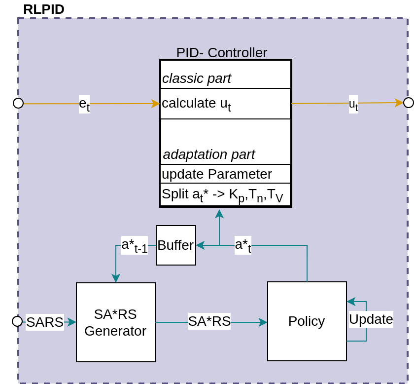

RLPID-Policy 
==============================

The **RL PID controller** is a PID controller that uses **Reinforcement Learning (RL) algorithms** to adaptively adjust the PID parameters during the running process. This enables the controller to dynamically improve its performance in response to changing system conditions.

The adaptive PID controller consists of two main components:

1. **OAControllerRL:** The main RL controller structure.
2. **RLPID Policy:** The OAControllerRL-policy responsible for adaptively tuning the parameters.

Components of the RLPID Policy
------------------------------------------

**a) PID Controller**

The **PID controller** provides a robust and flexible way to regulate a system’s behavior by adjusting its output based on the error between the desired setpoint and the measured process variable. It incorporates the proportional, integral, and derivative components to achieve precise control.

**b) Internal Policy**

The **internal policy** uses a reinforcement learning algorithm to adjust the PID parameters adaptively. It relies on the **SARS tuple** for decision-making:

- **State:** The control error (difference between the setpoint and the process variable).  
- **Action:** A tuple consisting of the PID parameters :math:`K_P, T_n,T_v` :  
  - :math:`K_P` : Proportional gain.  
  - :math:`T_n` : Integral time constant.  
  - :math:`T_v` : Derivative time constant.  
- **Reward:** Computed using a reward function based on the control error.

By analyzing the **state** (control error) and applying **actions** (adjusting PID parameters), the internal policy continuously optimizes the controller’s performance. The reward signal guides the RL algorithm to minimize the control error and improve system behavior over time.

Workflow of the RLPID Policy (classic part)
--------------------------------------------

1. The RLPID observes the current **control error**. 
2. It forwards the control error to its internal **PID controller**
2. It uses the internal PID controller to calculate the **control variable **based on the current :math:`K_P, T_n,T_v` .

Workflow of the RLPID Policy (adaptive part)
--------------------------------------------

1. The RLPID observes the current **state** (control error).  
2. It computes an **action** (adjustment of :math:`K_P, T_n,T_v` based on the RL algorithm.  
3. The system response is evaluated, and a **reward** is calculated using the reward function.  
4. The internal policy updates its internal parameters to improve future performance based on the reward.

Advantages of the Adaptive PID Controller
------------------------------------------

- **Dynamic adaptation:** Automatically adjusts PID parameters in real-time to handle varying system conditions.
- **Increased accuracy:** Reduces control error by continuously optimizing parameters.
- **Flexibility:** Combines the robustness of PID control with the adaptability of reinforcement learning.

Applications
------------

The online adaptive PID controller is suitable for systems where conditions change dynamically and traditional static PID tuning is insufficient, such as:

- Industrial automation.
- Robotics.
- Process control with varying loads or environmental factors.

**PID Controller can be imported and used as following:**

.. code-block:: python

    #import PID controller  model
    from mlpro.oa.control.controllers import RLPID

    #create a RLPID policy object
    rl_pid_policy = RLPID(p_observation_space = my_ctrl_sys.get_state_space(),
                    p_action_space = p_pid_output_space,
                    p_pid_controller = my_pid_ctrl,
                    p_policy = poliy_wrapper,
                    p_visualize = visualize,
                    p_logging = logging )

**Cross Reference**

- :ref:`Howto_OA_CONTROL_101 <Howto_OA_CONTROL_101>`

- :ref:`API References RLPID <target_api_oa_control_controllers_pid_controller>`

