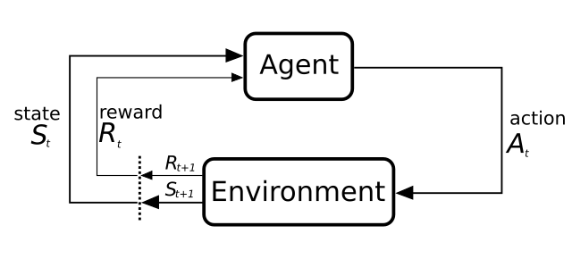

.. _target_overview_RL:
Overview
--------

MLPro-RL is the first ready-to-use subpackage in MLPro that is intended for reinforcement learning (RL)-related activities.
MLPro-RL provides complete base classes of the main RL components, e.g. agent, environment, policy, multiagent, and training.
The training loop is developed based on the Markov Decision Process (MDP) model, as shown in the following diagram.

  
  This figure is taken from `Sutton and Barto, licensed by CC BY-NC-ND 2.0 <https://dl.acm.org/doi/10.5555/3312046>`_.

An MDP model contains two major components, such as the environment and the agent.
The agent can be considered as the decision maker, who chooses actions based on its policy by taking into account the current state of the environment.
The environment is the surrounding where the agent lives and interacts. The actual condition in the environment is represented by states.
MDP formulates the interaction between the agent and the environment, where the agent selects an action and sends the action to the environment.
The environment reacts to the given action that makes the condition in the environment change.
Then, the environment sends back the information in the form of states and reward to indicate the actual condition in the environment and the impact of the taken action on the environment respectively.
Afterwards, the agent can adapt its policy and repeat the interactions until reaching optimality.

MLPro-RL can handle a broad scope of RL training, including model-free RL or model-based RL, single-agent or multi-agent, and simulation or real hardware mode.
Hence, this subpackage can be a one-stop solution for students, educators, RL engineers or RL researchers to support their RL-related tasks.
The structure of MLPro-RL can be found in the following figure.

.. figure:: images/MLPro-RL_overview.png
  :width: 600
  
  This figure is taken from `MLPro 1.0 paper <https://doi.org/10.1016/j.mlwa.2022.100341>`_.

If you are interested to utilize MLPro-RL, you can easily access the RL modules, as follows:

    .. code-block:: python

        from mlpro.rl import *

Additionally, you can find the more comprehensive explanations of MLPro-RL including a sample application on controlling a UR5 Robot in this paper:
`MLPro 1.0 - Standardized Reinforcement Learning and Game Theory in Python <https://doi.org/10.1016/j.mlwa.2022.100341>`_.

**Learn more**

  - :ref:`Getting started with MLPro-RL <target_getstarted_RL>`

**Cross Reference**

  - :ref:`Related Howtos <target_appendix1_RL>`
  - :ref:`API Reference: MLPro-RL <target_api_rl>`
  - :ref:`API Reference: MLPro-RL Pool of Objects <target_api_pool_rl>`
  - `MLPro 1.0 Paper <https://doi.org/10.1016/j.mlwa.2022.100341>`_
  - `MLPro GitHub <https://github.com/fhswf/MLPro/tree/main/src/mlpro/rl/examples>`_