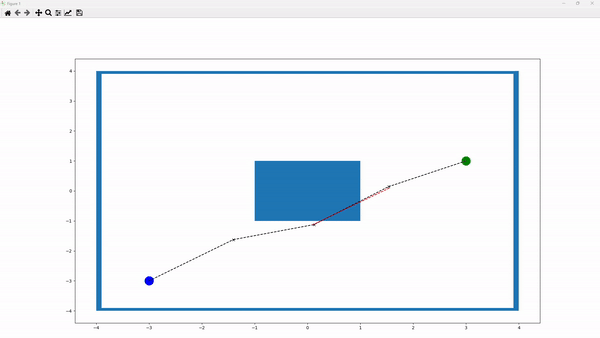

.. _coldec:
2D Collision Avoidance
^^^^^^^^^^^^^^^^^^^^^^

.. automodule:: mlpro.rl.pool.envs.collisionavoidance_2D

The above figure illustrates a sample running environment.
In this environment, the blue box in the center represents a collision.
The blue node indicates the starting point, while the green node denotes the target.
The "x" nodes represent intermediate nodes generated to create a path between the starting and target nodes.
Paths between nodes are depicted as linear connections.
A black line between two nodes signifies a collision-free path, whereas a red line indicates a collision along the path.
Additionally, red "x" nodes denote nodes involved in collisions, while black "x" nodes indicate non-colliding nodes.

The number of points can be defined by the parameter **p_cycle_limit**.
For example, if **p_cycle_limit** is set to 5, the environment will include a starting node, a target node, and 3 "x" nodes.
Users can also define the size of the environment by adjusting the **p_xlimit** and **p_ylimit** parameters of the frame.
The starting node is specified by the **p_start_pos** parameter.
The target node, however, is dynamic, allowing multiple target nodes to be chosen randomly each time the environment is reset.
This list of target nodes is defined by the **p_multi_goals** parameter.
Additionally, obstacles can be repositioned by modifying the **p_obstacles** parameter.

Every time the environment is reset, we begin with a straight line where the "x" nodes are placed equidistantly along the linear path from the starting node to the target node.
The objective is to adjust the positions of the "x" nodes to avoid collisions and to find the shortest possible path.

The 2D collision avoidance environment can be imported via:

.. code-block:: python

    from mlpro.rl.pool.envs.collisionavoidance_2D import DynamicTrajectoryPlanner

**Prerequisites**
Please install below packages to use the MLPro's 2D collision avoidance environment

 - `NumPy <https://pypi.org/project/numpy/>`_
 - `Matplotlib <https://pypi.org/project/matplotlib/>`_

**General information**

+------------------------------------+------------------------------------------------------------------------+
|         Parameter                  |                         Value                                          |
+====================================+========================================================================+
| Agents                             | 1                                                                      |
+------------------------------------+------------------------------------------------------------------------+
| Native Source                      | MLPro                                                                  |
+------------------------------------+------------------------------------------------------------------------+
| Action Space Dimension             | [p_num_point-2,2], default: [3,2]                                      |
+------------------------------------+------------------------------------------------------------------------+
| Action Space Base Set              | Real numbers                                                           |
+------------------------------------+------------------------------------------------------------------------+
| Action Space Boundaries            | p_action_boundaries, default: [-0.02,0.02]                             |
+------------------------------------+------------------------------------------------------------------------+
| State Space Dimension              | [p_num_point,2], default: [5,2]                                        |
+------------------------------------+------------------------------------------------------------------------+
| State Space Base Set               | Real numbers                                                           |
+------------------------------------+------------------------------------------------------------------------+
| State Space Boundaries             | x-axis: p_xlimit, default: [-4,4]. y-axis: p_ylimit, default: [-4,4].  |
+------------------------------------+------------------------------------------------------------------------+
| Reward Structure                   | Individual reward for each agent                                       |
+------------------------------------+------------------------------------------------------------------------+
    

**Action space**

In this environment, we control the movement of the "x" nodes along the x- and y-axes, which is defined as the action of the agent.
Therefore, the action space dimension of the agent is [p_num_point-2, 2].
For instance, if **p_num_point** is 5, the action space dimension is [3, 2].
Additionally, the action boundaries are defined by the parameter **p_action_boundaries** during the initialization of the environment.
This means that each "x" node can only move within these boundaries along the x- and y-axes at each time step.
  
  
**State space**

The state information in this environment consists of the positions of each node, including the starting node, the current positions of the "x" nodes, and the current target node.
Each position includes both x- and y-coordinates.
Therefore, the state space dimension is [p_num_point, 2]. For example, if **p_num_point** is 5, the state space dimension is [5, 2].
  
  
**Reward structure**

Currently, there is no predefined reward function in this environment.
Users who wish to create a custom reward function can refer to the following code snippet as a guide:

.. code-block:: python

    class MyDynamicTrajectoryPlanner(DynamicTrajectoryPlanner):
        
        def _compute_reward(self, p_state_old:State, p_state_new:State) -> Reward:
            
            number_of_collide_points = 0
            number_of_collide_lines = 0
            for _ in self.collide_point_list:
                number_of_collide_points += 1
            for _ in self.collide_line_list:
                number_of_collide_lines += 1

            distance = self._calc_distance()
            
            total_rewards = 0
                
            reward = Reward()
            reward.set_overall_reward(total_rewards)
            
            return reward
 
The provided code snippet outlines parameters that can assist in calculating custom reward functions:

    (1) **number_of_collide_points**: Represents the count of points colliding with obstacles.

    (2) **number_of_collide_lines**: Indicates the number of lines colliding with obstacles.

    (3) **distance**: Refers to the current trajectory distance from the starting to the target nodes through all "x" nodes.

Users can define their own reward function by replacing **total_rewards=0** with their specific logic.

**Cross reference**

    + :ref:`API reference <target_pool_rl_env_2dcol>`

**Citation**

If you apply this environment in your research or work, please :ref:`cite <target_publications>` us.