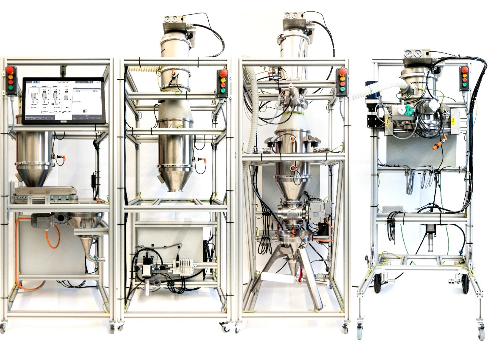

.. _BGLP:
Bulk Good Laboratory Plant (BGLP)
^^^^^^^^^^^^^^^^^^^^^^^^^^^^^^^^^^

.. automodule:: mlpro.rl.pool.envs.bglp

The BGLP illustrates a smart production system with high flexibility and distributed control to transport bulk raw materials.
One of the advantages of this laboratory test belt is the modularity in design, as depicted schematically below:

The BGLP consists of four modules, which are loading, storing, weighing, and filling stations respectively, and has conveying and dosing units as integral parts of the system.
The interface between the modules is assembled via a mini hopper placed in the prior module. 
Then, the next module is fed by a vacuum pump, which operates in a discontinuous manner, before the goods are temporarily stored in a silo of the next module. 
The filling station has no silo because the main purpose of the station is to occupy the transport containers.

We utilize dissimilar actuators in modules 1-3 to transport the goods from the silo to the mini hopper. 
Module 1 utilizes a belt conveyor, that operates between 0 and 1800 rpm. 
Module 2 uses a vibratory conveyor, which can be completely switched on and off. 
Lastly, Module 3 utilizes a rotary feeder, that operates between 0 and 1450 rpm.

In the RL context, we consider the BGLP as a multi-agent system, where each actuator of the system is pointed as an agent or a player.
The states information for each agent is the fill level of the prior reservoir and the fill level of the next reservoir.

.. note::

    In this simulation, we assume that the actuator in Module D has a constant flow, which automatically matches the production demand in L/s.
    This parameter can be defined while setting up the BGLP environment.
    Therefore, 5 actuators are involved in this simulation instead of 6 actuators.

The BGLP environment can be imported via:

.. code-block:: python

    import mlpro.rl.pool.envs.bglp

**Prerequisites**
Please install below package to use the MLPro's BGLP environment

 - `NumPy <https://pypi.org/project/numpy/>`_

**General Information**

+------------------------------------+-------------------------------------------------------+
|         Parameter                  |                         Value                         |
+====================================+=======================================================+
| Agents                             | 5                                                     |
+------------------------------------+-------------------------------------------------------+
| Native Source                      | MLPro                                                 |
+------------------------------------+-------------------------------------------------------+
| Action Space Dimension             | [5,]                                                  |
+------------------------------------+-------------------------------------------------------+
| Action Space Base Set              | Real numbers, except Agent 3 uses Integer             |
+------------------------------------+-------------------------------------------------------+
| Action Space Boundaries            | [0,1]                                                 |
+------------------------------------+-------------------------------------------------------+
| State Space Dimension              | [6,]                                                  |
+------------------------------------+-------------------------------------------------------+
| State Space Base Set               | Real numbers                                          |
+------------------------------------+-------------------------------------------------------+
| State Space Boundaries             | [0,1]                                                 |
+------------------------------------+-------------------------------------------------------+
| Reward Structure                   | Individual reward for each agent                      |
+------------------------------------+-------------------------------------------------------+

.. note::

    You can change the configurations of the BGLP simulation, for instance, production demand (L/s), production target for batch operation (L),
    learning rates for reward calculation, and production scenario (batch or continuous).
    Batch production scenario refers to a process to satisfy a specific order in a sequence, thus the production target in L must be set.
    Meanwhile, continuous production scenario refers to a process to control a constant flow within a horizon, thus the production target (L) is not necessary
    and the target is fulfilled the production demand (L/s).
    The detailed explanations are available in the API reference
    section, see :ref:`here <api-ref-bglp>`.
    

**Action Space**

In this environment, we consider 5 actuators to be controlled. 
Thus, there are 5 agents and 5 joint actions because each agent requires an action.
Every action is normalized within a range between 0 and 1, except for Agent 3.
0 means the minimum possible action and 1 means the maximum possible action.
For Agent 3, the vibratory conveyor has a different character than other actuators, which mostly perform in a continuous manner.
The vibratory conveyor can only be either fully switched-on or switched-off. Therefore the base set of action for Agent 3 is an integer (0/1).
0 means off and 1 means on.

+-------+-------------------+--------+-------------------+--------------+
| Agent | Actuator          | Station| Parameter         | Boundaries   |
+=======+===================+========+===================+==============+
|   1   | Conveyor Belt     | A      | rpm               | 450 ... 1800 |
+-------+-------------------+--------+-------------------+--------------+
|   2   | Vacuum Pump       | B      | on-duration (sec) | 0 ... 4.575  |
+-------+-------------------+--------+-------------------+--------------+
|   3   | Vibratory Conveyor| B      | on/off            | 0/1          |
+-------+-------------------+--------+-------------------+--------------+
|   4   | Vacuum Pump       | C      | on-duration (sec) | 0 ... 9.5    |
+-------+-------------------+--------+-------------------+--------------+
|   5   | Rotary Feeder     | C      | rpm               | 450 ... 1450 |
+-------+-------------------+--------+-------------------+--------------+
  
  
**State Space**

The state information in the BGLP is the fill levels of the reservoirs.
Each agent is always placed in between two reservoirs, e.g. between a silo and a hopper or vice versa.
Therefore, each agent has two state information, which is shared with their neighbours.
Every state is normalized within a range between 0 and 1.
0 means the minimum fill-level and 1 means the maximum fill-level.

+------+----------+--------+--------+---------------+
| Agent| State No.| Element| Station| Boundaries    |
+======+==========+========+========+===============+
|      | 1        | Silo   | A      | 0 ... 17.42 L |
+ 1    +----------+--------+--------+---------------+
|      | 2        |        |        |               |
+------+----------+ Hopper + A      + 0 ... 9.1 L   +
|      | 1        |        |        |               |
+ 2    +----------+--------+--------+---------------+
|      | 2        |        |        |               |
+------+----------+ Silo   + B      + 0 ... 17.42 L +
|      | 1        |        |        |               |
+ 3    +----------+--------+--------+---------------+
|      | 2        |        |        |               |
+------+----------+ Hopper + B      + 0 ... 9.1 L   +
|      | 1        |        |        |               |
+ 4    +----------+--------+--------+---------------+
|      | 2        |        |        |               |
+------+----------+ Silo   + C      + 0 ... 17.42 L +
|      | 1        |        |        |               |
+ 5    +----------+--------+--------+---------------+
|      | 2        | Hopper | C      | 0 ... 9.1 L   |
+------+----------+--------+--------+---------------+
  
  
**Reward Structure**

The reward structure is implemented according to `this paper <https://doi.org/10.1016/j.compchemeng.2021.107382>`_.
You can also find the source code of the reward structure, `here <https://github.com/fhswf/MLPro/blob/13b7b8a82d90b626f40ea7c268706e43889b9e00/src/mlpro/rl/pool/envs/bglp.py#L971-L982>`_.
The given reward is an individual scalar reward for each agent. To be noted, this reward function is more suitable for a continuous production scenario.

If you would like to implement a customized reward function, you can follow these lines of codes:

.. code-block:: python

    class MyBGLP(BGLP):
    
        def calc_reward(self):
        
            # Each agent has an individual reward
            if self.reward_type == Reward.C_TYPE_EVERY_AGENT:
                for actnum in range(len(self.acts)):
                    acts = self.acts[actnum]
                    self.reward[actnum] = 0
                return self.reward[:]
                
            # Overall reward
            elif self.reward_type == Reward.C_TYPE_OVERALL:
                self.overall_reward = 0
                return self.overall_reward
 

**Cross Reference**

    + :ref:`API Reference <Bulk Goods Plant>`

**Citation**

If you apply this environment in your research or work, please :ref:`cite <target_publications>` us and the `original paper <https://doi.org/10.1016/j.compchemeng.2021.107382>`_.