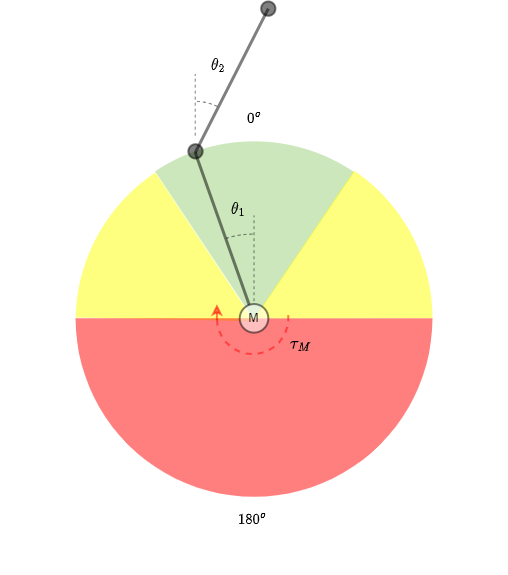

.. _DoublePendulum:
Double Pendulum
^^^^^^^^^^^^^^^^^^

.. automodule:: mlpro.rl.pool.envs.doublependulum

.. note::
 MLPro provides two implementations of Double Pendulum environment named DoublePendulumS4 and DoublePendulumS7. 
    + The DoublePendulumS4 environment is a basic implementation with four dimensional state space including angles and angular velocities of both the poles.
    + The static 7 dimensional implementation of Double Pendulum environment in MLProis a seven dimensional state space with derived angular acceleration values and input torque. MLPro also provides a default reward strategy based on normalized state space and Euclidean Distances of the states.

The double pendulum environment can be imported via:

.. code-block:: python

    from mlpro.rl.pool.envs.doublependulum import *

The environment can be initialised with specifying the initial angles of both poles, masses of both poles, lenghts of poles, maximum torque value and scenario related parameters including step size and actuation step size. The initial positions of the poles refer to the position of the poles at the beginning of each RL episode, which can be set to 'up', 'down', 'random'. The default values for length and mass of each pole in the double pendulum are set to 1 and 1 respectively. The environment behaviour can be understood by running How To 20 in MLPro's sample implementation examples.

.. note::
 + The visualisation of the environment can be turned off by setting the visualize parameter in training/scenario initialisation to false

**Screenshots**

.. image:: images/doublependulum.gif
    :width: 650px
    :align: center

    
**Prerequisites**
Please install below packages to use the MLPro's double pendulum environment

    - `NumPy <https://pypi.org/project/numpy/>`_
    - `Matplotlib <https://pypi.org/project/matplotlib/>`_
    - `SciPy <https://pypi.org/project/scipy/>`_

**General Information**

+------------------------------------+-------------------------------------------------------+
|         Parameter                  |                         Value                         |
+====================================+=======================================================+
| Agents                             | 1                                                     |
+------------------------------------+-------------------------------------------------------+
| Native Source                      | MLPro                                                 |
+------------------------------------+-------------------------------------------------------+
| Action Space Dimension             | 1                                                     |
+------------------------------------+-------------------------------------------------------+
| Action Space Base Set              | Real number                                           |
+------------------------------------+-------------------------------------------------------+
| State Space Dimension              | 4   (for DoublePendulumS4), 7  (for DoublePendulumS7) |
+------------------------------------+-------------------------------------------------------+
| State Space Base Set               | Real number                                           |
+------------------------------------+-------------------------------------------------------+
| Reward Structure                   | Overall reward                                        |
+------------------------------------+-------------------------------------------------------+
 
**Action Space**
The goal of the environment is to maintain the vertical position of both the poles. The inner pole is actuated by a motor, and thus the action space of Double Pendulum environment is a continuous variable ranging between the negative maximum torque and positive maximum torque, where positive torque refers to clockwise torque and vice versa. The max torque can be passed as a :ref:`parameter <Double Pendulum>` in the initialisation of environment. 

+------------------------------------+-------------------------------------------------------+
|         Parameter                  |                         Range                         |
+====================================+=======================================================+
| Torque                             | [-max_torque, max_torque]                             |
+------------------------------------+-------------------------------------------------------+

**State Space**

The state space for the double pendulum environment returns state of poles in the system including angles of both poles, velocity of poles, angular acceleration of the poles. The states for double pendulum environment can be understood by the table below.

+------------------------------------+------------------------------------+----------------------------------+-------------------------------------------------------+------------------------------+-------------------------+
|         State                      |         Description                |               Range              |			Unit				     |   DoublePendulumS4           |   DoublePendulumS7      |
+====================================+====================================+==================================+=======================================================+==============================+=========================+
| Theta 1                            |Angle of the inner pole             | [-180, 180]	                     |	degrees                                              |              X               |            X            |
+------------------------------------+------------------------------------+----------------------------------+-------------------------------------------------------+------------------------------+-------------------------+
| Omega 1                            |Angular velocity of inner pole      | [-800, 800]		             |	degrees per second                                   |		    X		    |            X            |
+------------------------------------+------------------------------------+----------------------------------+-------------------------------------------------------+------------------------------+-------------------------+
| Alpha 1                            |Angular Acceleration of outer pole  | [-6800, 6800]	             |	degrees per second squared                           |              \-              |            X            |
+------------------------------------+------------------------------------+----------------------------------+-------------------------------------------------------+------------------------------+-------------------------+
| Theta 2                            |Angle of the outer pole             | [-180, 180]	                     |	degrees                                              |              X               |            X            |
+------------------------------------+------------------------------------+----------------------------------+-------------------------------------------------------+------------------------------+-------------------------+
| Omega 2                            |Angular velocity of outer pole      | [-950, 950]	                     |	degrees per second                                   |              X               |            X            |
+------------------------------------+------------------------------------+----------------------------------+-------------------------------------------------------+------------------------------+-------------------------+
| Alpha 2                            |Angular acceleration of outer pole  | [-9700, 9700]	             |	degrees per second squared                           |              \-              |            X            |
+------------------------------------+------------------------------------+----------------------------------+-------------------------------------------------------+------------------------------+-------------------------+
| Torque                             |Input torque to the inner pole      | [-max torque, max torque]        |	Newton times meter                                   |              \-              |            X            |
+------------------------------------+------------------------------------+----------------------------------+-------------------------------------------------------+------------------------------+-------------------------+

.. note:: 
 The boundaries for the velocity and acceleration are highly influenced by the initital position of the arms and the current torque being actuated on the inner pole. These parameters are further dependent on the specific application, scenario or purpose of research.

Current implementation of DP environment in MLPro returns success when the current state of the environment is within a distance lesser than threshold distance from the goal state. 

**Reward Structure**

The goal of the environment is to reach a complete vertical position for both the inner and outer pole, i.e.
the goal state is given as vector :math:`S_g = (0,0,0,0,0,0)`. The environment delivers a continuous reward to the
agent based on the new and old states of the environment. The environment is divided into three zones based on the
position of the inner and outer pole.

As shown in the figure above, the three zones and the reward strategies corresponding to the zone are:

1. **Red Zone** : The swing up zone for angle of inner pole less than :math:`-90^o` or more than :math:`+90^o`. The
reward signal in this zone maximizes the motion of the inner pole of the double pendulum.

..

    :math:`r_a(t) = (|\theta_{1n(t - 1))} - \theta_{1n(t)}|) + (|\theta'_{1n(t)} +\theta^n_{1n(t-1)}| - |\theta'_{1n(t-1)} + \theta^n_{1n(t-1)}|)`

    where,
        :math:`r_a(t)` is reward at time step t,

        :math:`\theta_{1n}` is normalized angle of inner pole

        :math:`\theta_{2n}` is normalized angle of outer pole

2. **Yellow Zone** : Outer pole swing up zone for angle of inner pole more than :math:`-90^o` or less than
:math:`+90^o`. The reward is based on the euclidean distance between new and old states, with 75% weight to the
states of outer pole and 25% to that of inner pole.

..

    :math:`r_b(t) = |s_{gb} - s_{b(t-1)}| - |s_{gb} - s{b(t)}|`

    where,
        :math:`s_b` is the state space in yellow zone as :math:`(\theta_{1n}, \theta_{2n}, \theta_{2n}',\theta_{2n}'')`

        :math:`s_{gb}` is the goal state in Yellow zone, i.e. :math:`(0,0,0,0)`

3. **Green Zone** : Balancing zone for angle of either or both inner or outer pole more than :math:`-36^o` or less than
:math:`+36^o`. The reward in this zone is proportional to the environments progress towards the goal state.

..

    :math:`r_a(t) = |s_{gn} - s_{n(t-1)}| - |s_{gn} - s_{n(t)}|`

    where,
        :math:`s_{gn}` is the normalized goal state of the environment

        :math:`s_n` is the normalized state

**Cross Reference**
    + :ref:`Howto RL-ENV-005: SB3 Policy on Double Pendulum Environment <Howto Env RL 005>`
    + :ref:`API Reference <target_pool_rl_env_double_pendulum>`

**Citation**

If you apply this environment in your research or work, please :ref:`cite <target_publications>` us.