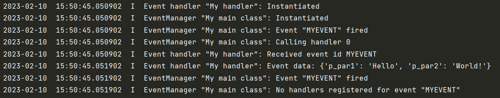

.. _Howto BF EH 001:
Howto BF-EH-001: Event Handling
====================================================

.. automodule:: mlpro.bf.examples.howto_bf_eh_001_event_handling

**Executable code**

.. literalinclude:: ../../../../../../../../src/mlpro/bf/examples/howto_bf_eh_001_event_handling.py
	:language: python

**Results**

**Cross References**

+ :ref:`Event Handling <target_eventhandling_api>`