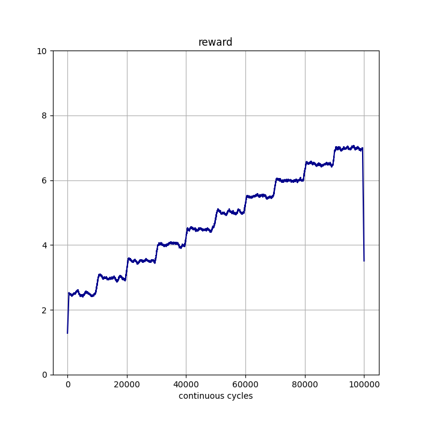
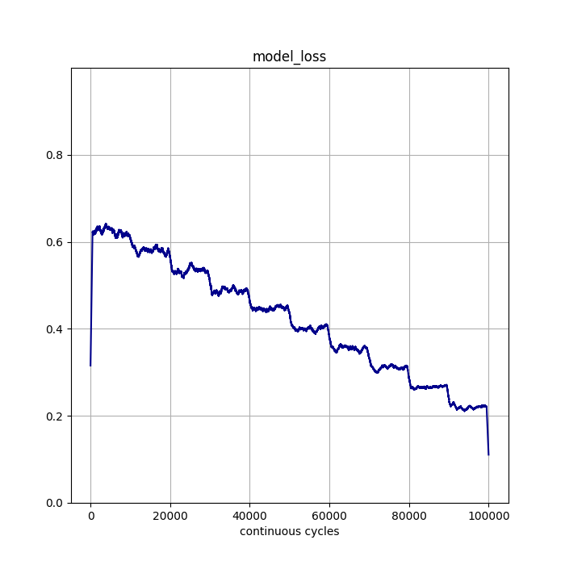

.. _Howto BF 003:
Howto BF-003: Store and plot data
=================================

.. automodule:: mlpro.bf.examples.howto_bf_003_store_plot_and_save_variables

**Prerequisites**

PLease install following packages to run this howto

+ `Matplotlib <https://matplotlib.org/>`_

**Executable code**

.. literalinclude:: ../../../../../../../src/mlpro/bf/examples/howto_bf_003_store_plot_and_save_variables.py
	:language: python

**Results**

.. image::
    images/states_1.png
    :width: 350 px

.. image::
    images/states_2.png
    :width: 350px

**Cross Reference**

+ :ref:`API Reference: Various <target_api_bf_various>`