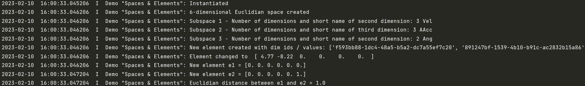

.. _Howto BF MATH 001:
Howto BF-MATH-001: Dimensions, Spaces and Elements
=============================================

.. automodule:: mlpro.bf.examples.howto_bf_math_001_spaces_and_elements

**Prerequisites**

Please install following packages to run this howto

+ `Numpy <https://www.numpy.org/>`_

**Executable code**

.. literalinclude:: ../../../../../../../../src/mlpro/bf/examples/howto_bf_math_001_spaces_and_elements.py
	:language: python

**Results**

**Cross Reference**

+ :ref:`API Documentation: Event Handling <target_api_event_handling>`