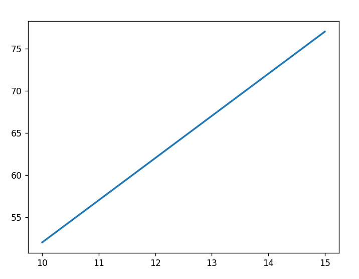
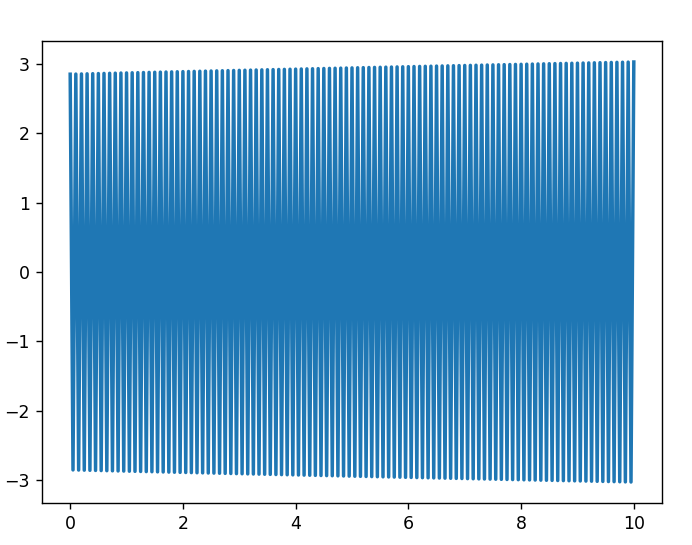

.. _Howto BF PHYSICS 001:
Howto BF-PHYSICS-001: Transfer Functions
==========================================

.. automodule:: mlpro.bf.examples.howto_bf_physics_001_set_up_transfer_functions

**Prereauistes**

Please install following packages to run this how to

+ `Matplotlib <https://www.matplotlib.org/>`_

**Executable code**

.. literalinclude:: ../../../../../../../../src/mlpro/bf/examples/howto_bf_physics_001_set_up_transfer_functions.py
	:language: python

**Results**

**Cross Reference**

+ :ref:`API Reference: Physics <target_ap_bf_physics>`