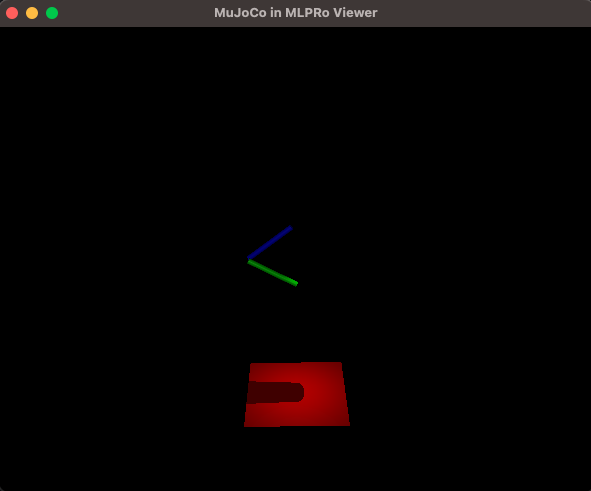

.. _Howto BF SYSTEMS 002:
Howto BF-SYSTEMS-002: Systems wrapped with MuJoCo
====================================================================

.. automodule:: mlpro.bf.examples.howto_bf_systems_002_systems_wrapped_with_mujoco

**Prerequisites**

Please install the following packages to run this examples properly:
    - `MuJoCo <https://pypi.org/project/mujoco/>`_
    - `lxml <https://pypi.org/project/lxml/>`_
    - 'glfw <https://pypi.org/project/glfw/>`_

**Executable code**

.. literalinclude:: ../../../../../../../../src/mlpro/bf/examples/howto_bf_systems_002_systems_wrapped_with_mujoco.py
	:language: python

**Results**

The MuJoCo windows appears and shows the simulation of a pendulum system.

**Cross Reference**

+ :ref:`API Reference: Systems <target_api_bf_systems>`