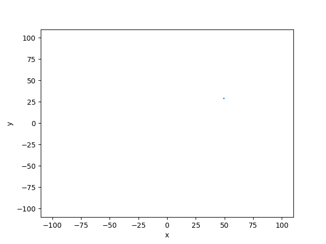

.. _Howto_BF_STREAMS_003:
Howto BF-STREAMS-003: Visualizing Moving 2D Clouds Provided By MLPro
================================================

.. automodule:: mlpro.bf.examples.howto_bf_streams_003_visualize_moving_clouds2d

**Executable code**

.. literalinclude:: ../../../../../../../../../src/mlpro/bf/examples/howto_bf_streams_003_visualize_moving_clouds2d.py
	:language: python

**Results**

.. code-block:: bashh

    YYYY-MM-DD  HH:MM:SS.SSSSSS  I  Stream "Dynamic Clouds 2D": Instantiated
    YYYY-MM-DD  HH:MM:SS.SSSSSS  I  Stream "Dynamic Clouds 2D": Reset
    YYYY-MM-DD  HH:MM:SS.SSSSSS  I  Stream "Dynamic Clouds 2D": Reset 

**Cross Reference**

+ :ref:`API Reference: Streams <target_ap_bf_streams>`
