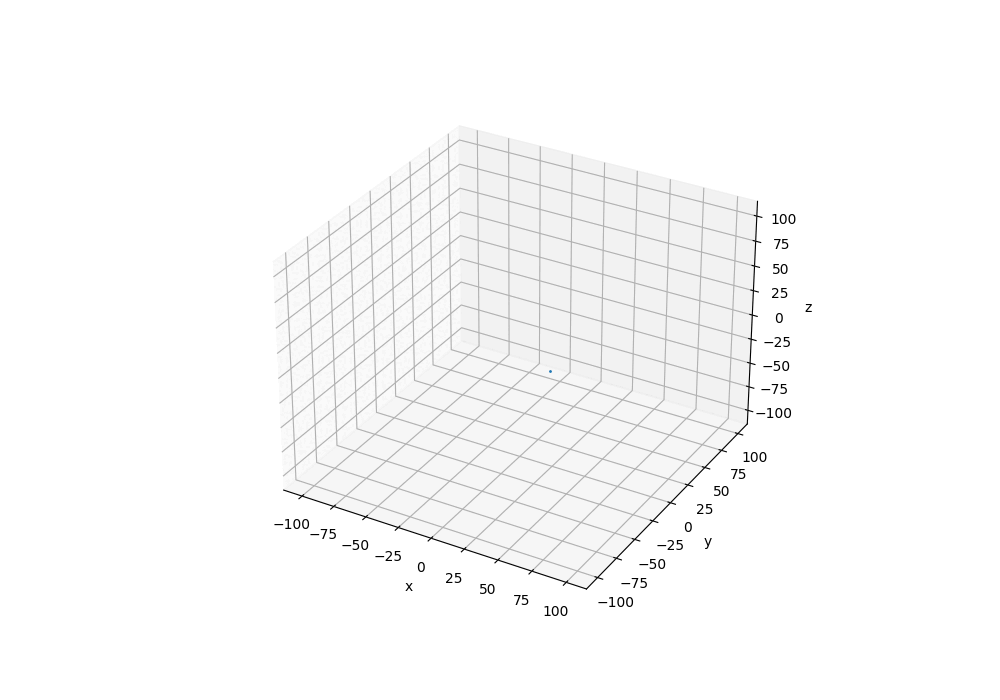

.. _Howto_BF_STREAMS_004:
Howto BF-STREAMS-003: Visualising Moving 3D Clouds Provided By MLPro
================================================

.. automodule:: mlpro.bf.examples.howto_bf_streams_004_visualise_moving_clouds3d

**Executable code**

.. literalinclude:: ../../../../../../../../../src/mlpro/bf/examples/howto_bf_streams_004_visualise_moving_clouds3d.py
	:language: python

**Results**

**Cross Reference**

+ :ref:`API Reference: Streams <target_ap_bf_streams>`
