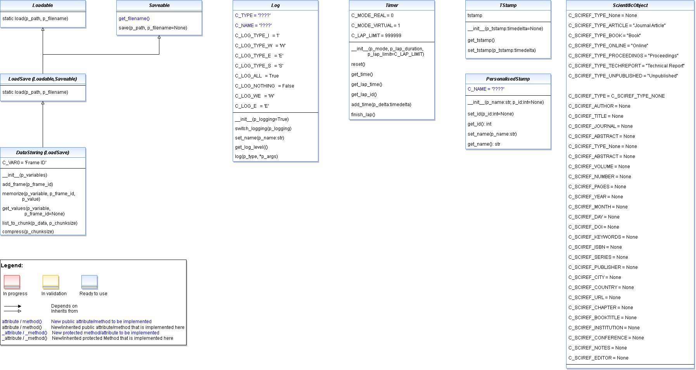
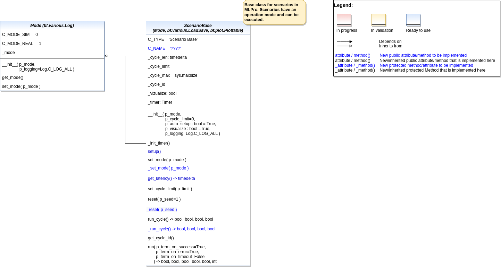
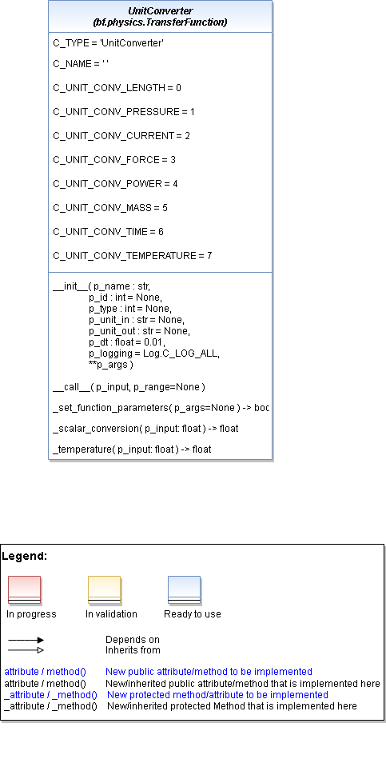
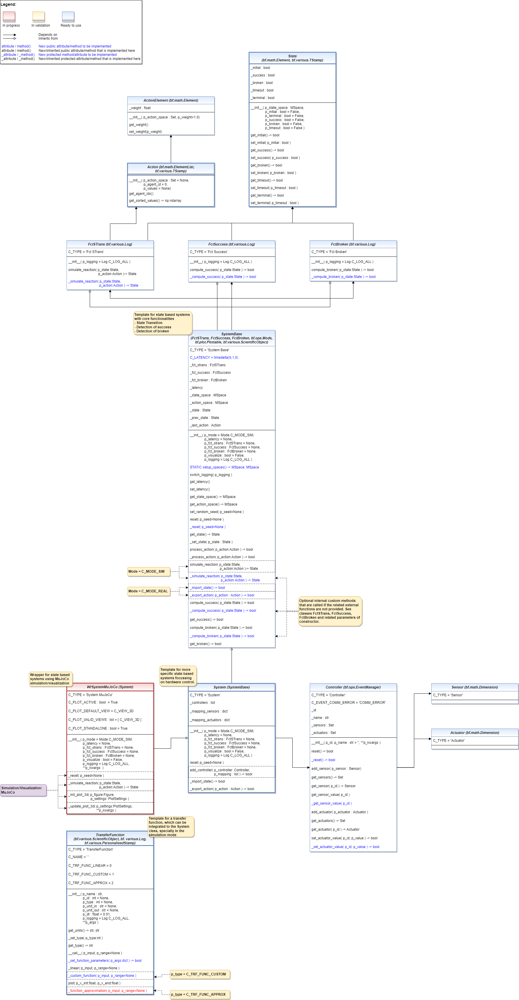
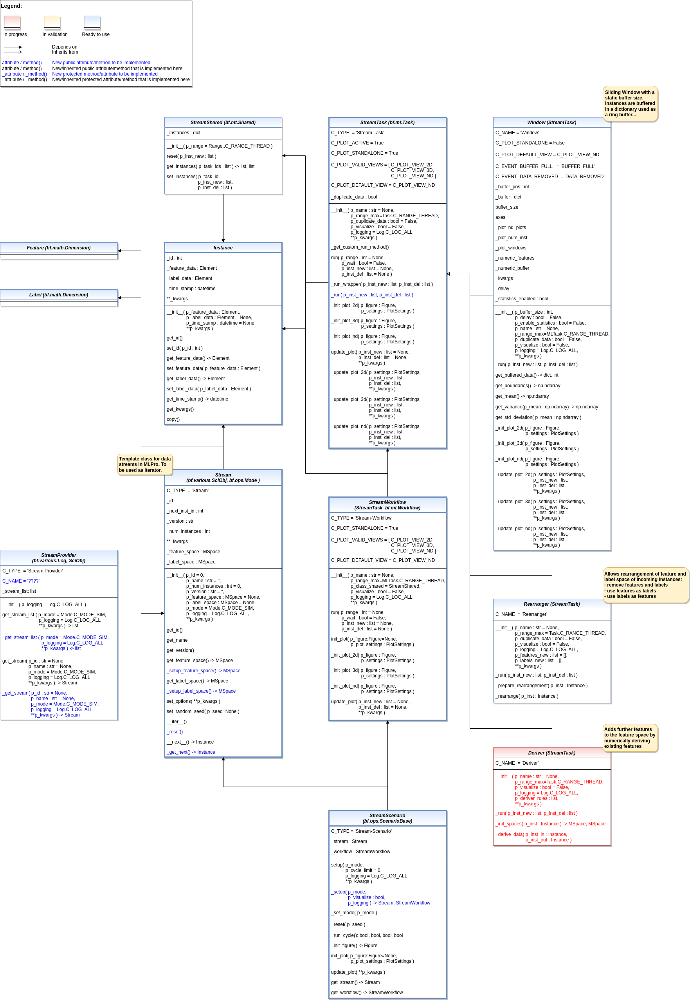
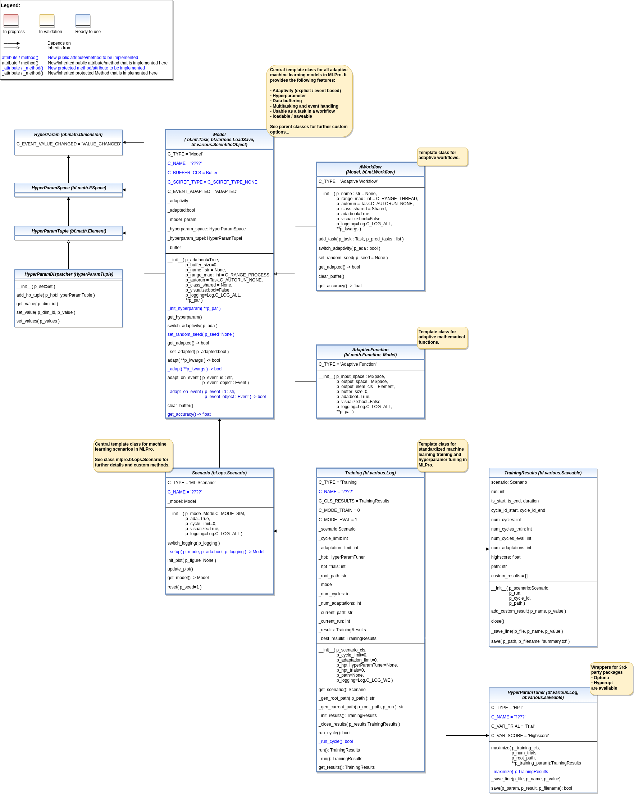

.. _target_appendix2_BF:
Basic Functions
================

Various
----------------

.. automodule:: mlpro.bf.various
   :members:
   :undoc-members:
   :show-inheritance:

   
Data Management
---------------

.. automodule:: mlpro.bf.data
   :members:
   :undoc-members:
   :show-inheritance:

   
Plotting and Visualization
--------------------------

.. image:: images/bf/MLPro-BF-Plot_class_diagram.drawio.png
.. automodule:: mlpro.bf.plot
   :members:
   :undoc-members:
   :show-inheritance:

   
Event Handling
--------------

.. image:: images/bf/MLPro-BF-Events_class_diagram.drawio.png
.. automodule:: mlpro.bf.events
   :members:
   :undoc-members:
   :private-members:
   :show-inheritance:

   
Exceptions
----------

.. automodule:: mlpro.bf.exceptions
   :members:
   :undoc-members:
   :show-inheritance:

Multitasking
------------

.. image:: images/bf/MLPro-BF-MT_class_diagram.drawio.png
.. automodule:: mlpro.bf.mt
   :members:
   :undoc-members:
   :show-inheritance:

Operation
------------

.. automodule:: mlpro.bf.ops
   :members:
   :undoc-members:
   :show-inheritance:

Mathematics
-----------

.. image:: images/bf/MLPro-BF-Math_class_diagram.drawio.png
.. automodule:: mlpro.bf.math.basics
   :members:
   :undoc-members:
   :show-inheritance:

Normalizers
-----------

.. image:: images/bf/MLPro-BF-Math-Normalizers_class_diagram.drawio.png
.. automodule:: mlpro.bf.math.normalizers
   :members:
   :undoc-members:
   :show-inheritance:

   
Physics
-------------------

.. image:: images/bf/MLPro-BF-Physics_class_diagram.drawio.png
.. automodule:: mlpro.bf.physics
   :members:
   :undoc-members:
   :show-inheritance:

Unit Converter
---------------

.. automodule:: mlpro.bf.physics.unitconverter
   :members:
   :undoc-members:
   :show-inheritance:

   
State-based Systems
-------------------

.. automodule:: mlpro.bf.systems
   :members:
   :undoc-members:
   :show-inheritance:

Stream Providers and Streams
----------------------------

.. automodule:: mlpro.bf.streams.models
   :members:
   :undoc-members:
   :show-inheritance:

.. _target_api_bf_ml:
Machine Learning
----------------

.. automodule:: mlpro.bf.ml
   :members:
   :undoc-members:
   :show-inheritance:
   

User Interaction
----------------

.. toctree::
   :maxdepth: 3

   ui/mlpro.ui.sciui
