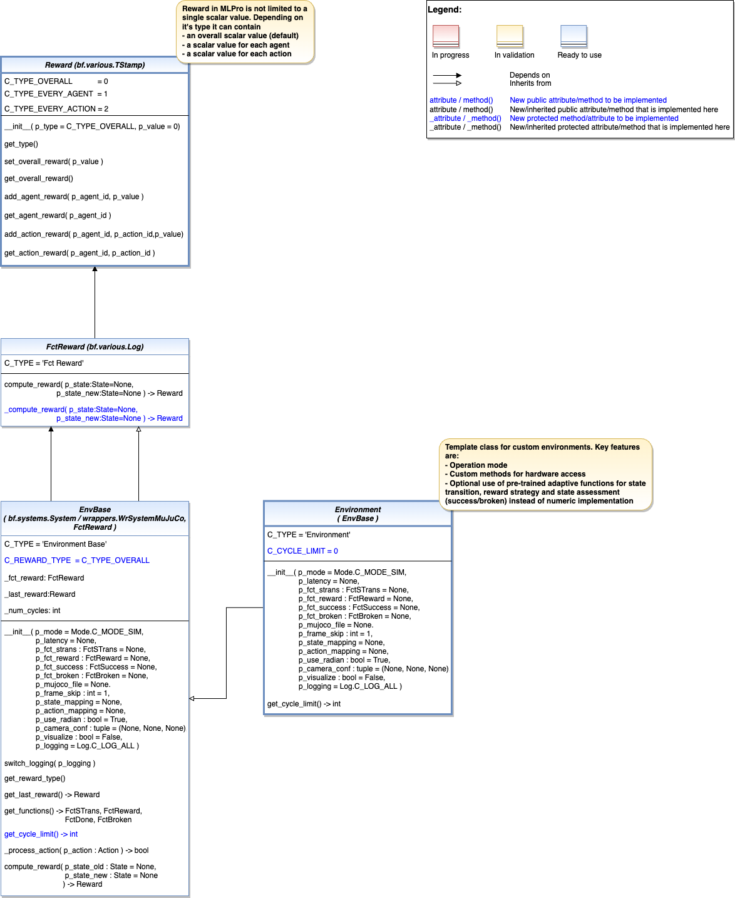
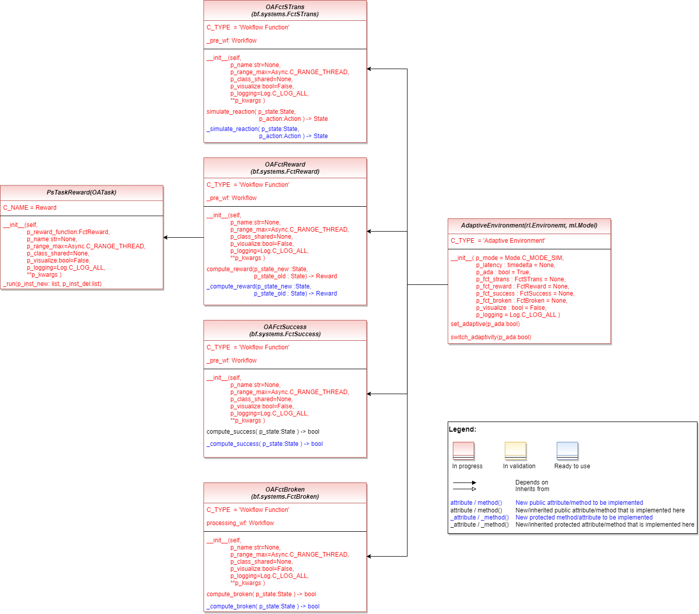

.. _target_appendix2_RL:
Reinforcement Learning
========================

Environments
------------

.. automodule:: mlpro.rl.models_env
   :members:
   :undoc-members:
   :show-inheritance:
   

Adaptive Environments
---------------------

.. automodule:: mlpro.rl.models_env_ada
   :members:
   :undoc-members:
   :show-inheritance:

Agents
------

.. image:: images/rl/02_agents/MLPro-RL-Agents_class_diagram.drawio.png
.. automodule:: mlpro.rl.models_agents
   :members:
   :undoc-members:
   :show-inheritance:
   
   
Scenarios, Training and Tuning
------------------------------

.. image:: images/rl/03_run_and_train/MLPro-RL-Train_class_diagram.drawio.png
.. automodule:: mlpro.rl.models_train
   :members:
   :undoc-members:
   :show-inheritance:
