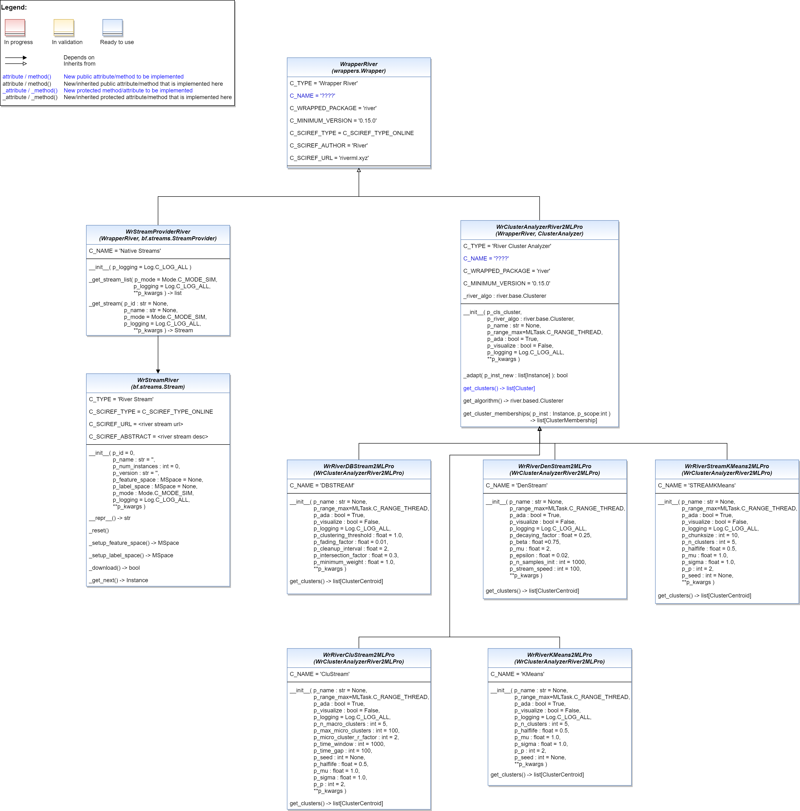

.. _Wrapper River:
River
=====

.. automodule:: mlpro.wrappers.river
    :members:
    :undoc-members:
    :show-inheritance:
    :private-members:
   

**Cross References**

- :ref:`Howto BF-STREAMS-053: Accessing Data from River<Howto BF STREAMS 053>`
