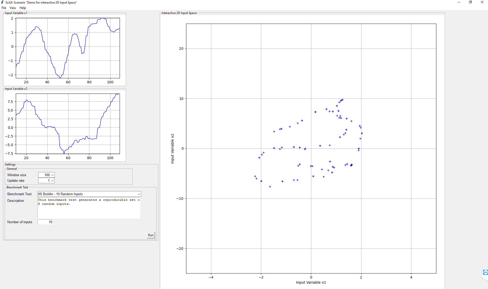

.. _Howto BF UI 001:
Howto BF-UI-001: SciUI - Reuse of interactive 2D/3D Input Space
===============================================================

.. automodule:: mlpro.bf.examples.howto_bf_ui_001_reuse_of_interactive_2d_3d_input_space

**Prerequisites**

Please install the following packages to run this example properly:
    - `Matplotlib <https://pypi.org/project/matplotlib/>`_
    - `Tkinter <https://pypi.org/project/tk/>`_

**Executable code**

.. literalinclude:: ../../../../../../../../../src/mlpro/bf/examples/howto_bf_ui_001_reuse_of_interactive_2d_3d_input_space.py
	:language: python

**Results**

The SciUI application should start and show an interactive demo of a 2D/3D input space as follows:

**Cross Reference**

+ :ref:`API Reference: SciUi <target_api_bf_ui_sciui>`
