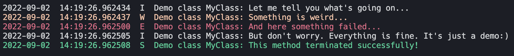

.. _Howto BF 001:
Howto BF-001: Logging
=====================

**Executable code**

.. literalinclude:: ../../../../../../../../../test/howtos/bf/howto_bf_001_logging.py
	:language: python

**Results**

**Cross Reference**

    - :ref:`API Reference: Various <target_api_bf_various>`