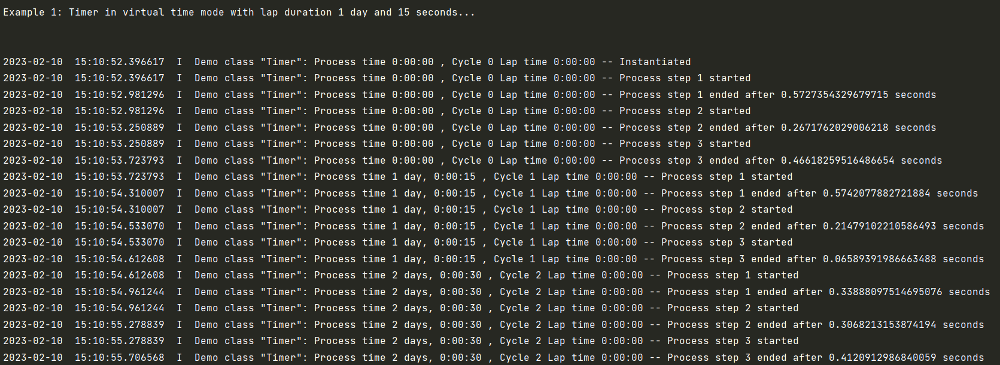

.. _Howto BF 002:
Howto BF-002: Timer
===================

**Executable code**

.. literalinclude:: ../../../../../../../../../test/howtos/bf/howto_bf_002_timer.py
	:language: python

**Results**

**Cross Reference**

    - :ref:`API Reference: Various <target_api_bf_various>`
