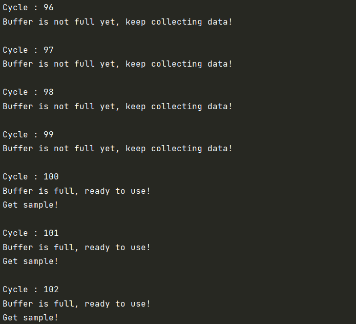

.. _Howto BF 004:
Howto BF-004: Buffers
=====================

Executable code
^^^^^^^^^^^^^^^

.. literalinclude:: ../../../../../../../../../src/mlpro/bf/examples/howto_bf_004_buffers.py
	:language: python

Results
^^^^^^^

Cross Reference
^^^^^^^^^^^^^^^

    - :ref:`API Reference: Various <target_api_bf_various>`