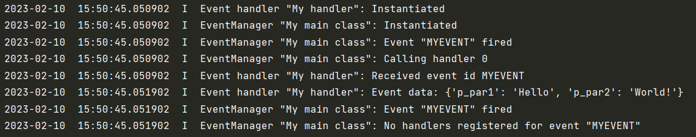

.. _Howto BF EH 001:
Howto BF-EH-001: Event Handling
===============================

**Executable code**

.. literalinclude:: ../../../../../../../../../test/howtos/bfs/howto_bf_eh_001_event_handling.py
	:language: python

**Results**

**Cross Reference**

    - :ref:`API Reference: Event Handling <target_api_bf_event>`