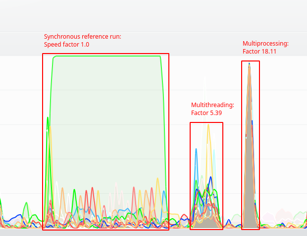

.. _Howto BF MT 001:
Howto BF-MT-001: Multitasking - Parallel Algorithms
===================================================

Prerequisites
^^^^^^^^^^^^^

Please install following packages to run this howto

	- `Multiprocess <https://pypi.org/project/multiprocess/>`_

Executable code
^^^^^^^^^^^^^^^

.. literalinclude:: ../../../../../../../../../src/mlpro/bf/examples/howto_bf_mt_001_parallel_algorithms.py
	:language: python

Results
^^^^^^^

The howto example logs details of the three runs and in particular the speed factors of multithreading and 
multiprocessing in comparison to the serial/synchronous execution. On a PC with an AMD Ryzen 7 CPU (8/16 cores)
running Linux, the system monitor shows an approx. 5x speedup with multithreading and an approx. 18x speedup with multiprocessing.

Cross Reference
^^^^^^^^^^^^^^^

	- :ref:`API Reference: Multitasking <target_api_bf_mt>`