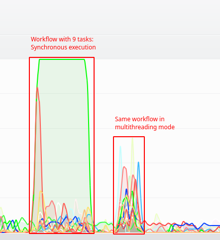

.. _Howto BF MT 002:
Howto BF-MT-002: Multitasking - Tasks and Workflows
===================================================

**Prerequisites**

To run this howto please install the following packages

	- `Multiprocess <https://pypi.org/project/multiprocess/>`_

**Executable code**

.. literalinclude:: ../../../../../../../../../test/howtos/bf/howto_bf_mt_002_tasks_and_workflows.py
	:language: python

**Results**

The howto example logs details of the two runs (workflow synchronously/multithreading). A short break
between the workflow runs allows a better observation of CPU load in the system monitor.

**Cross Reference**

	- :ref:`API Reference: Multiprocessing <target_api_bf_mt>`