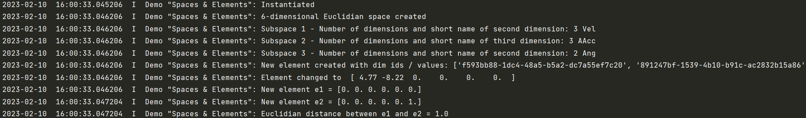

.. _Howto BF MATH 001:
Howto BF-MATH-001: Dimensions, Spaces and Elements
=============================================

**Prerequisites**

Please install following packages to run this howto

    - `Numpy <https://www.numpy.org/>`_

**Executable code**

.. literalinclude:: ../../../../../../../../test/howtos/bf/howto_bf_math_001_spaces_and_elements.py
	:language: python

**Results**

**Cross Reference**

    - :ref:`API Reference: Math <target_ap_bf_math>`