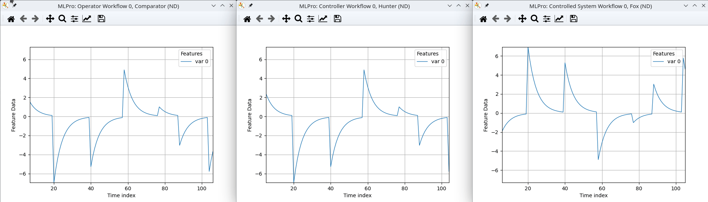

.. _Howto BF CONTROL 001:
Howto BF-CONTROL-001: Basic control system
==========================================

**Executable code**

.. literalinclude:: ../../../../../../../../../test/howtos/bf/control/howto_bf_control_001_basic_control_system.py
	:language: python

**Results**

**Cross Reference**

    - :ref:`API Reference: Closed-loop control <target_api_bf_control>`