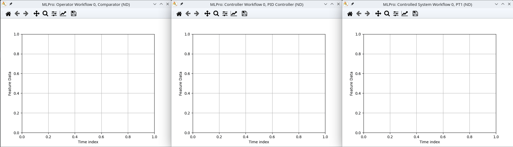

.. _Howto_BF_CONTROL_101:
Howto BF-CONTROL-101: PID-Controller with PT1 system
====================================================

**Executable code**

.. literalinclude:: ../../../../../../../../../test/howtos/bf/control/howto_bf_control_101_pid_controller_PT1.py
	:language: python

**Results**

    
**Cross Reference**

- :ref:`API References PT1 system <target_api_bf_systems_pool_pt1_system>`
- :ref:`API References PID-Controller <target_api_bf_control_controllers_pid_controller>`