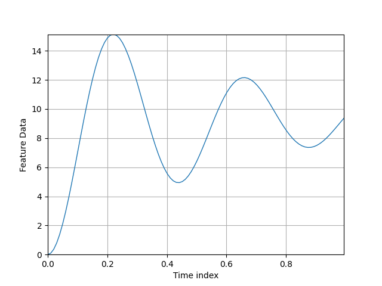
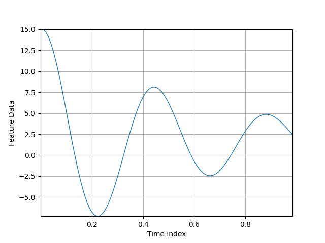
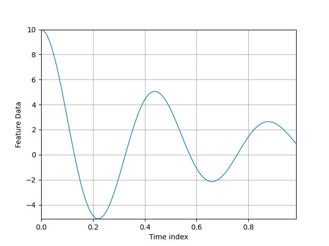

.. _Howto_BF_CONTROL_102:
Howto BF-CONTROL-102: PID-Controller with PT2 system
===============================

**Executable code**

.. literalinclude:: ../../../../../../../../../test/howtos/bf/control/howto_bf_control_102_pid_controller_PT2.py
	:language: python

**Results**

As shown below, the howto logs all steps and a demo window for visualization appears...

    
**Cross Reference**

- :ref:`API References PT2 system <target_api_bf_systems_pool_pt2_system>`
- :ref:`API References PID Controller <target_api_bf_control_controllers_pid_controller>`