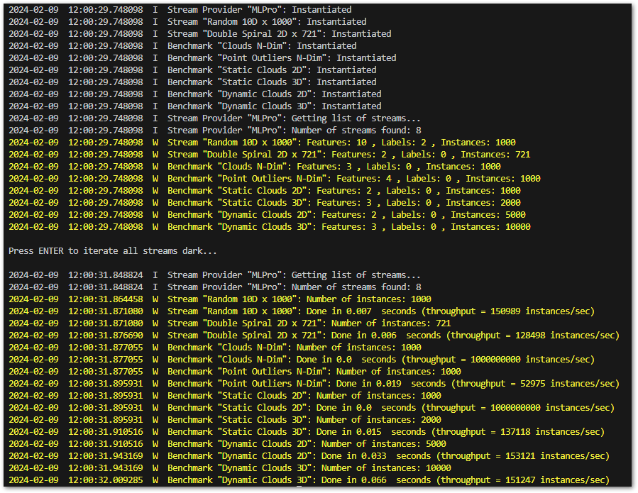

.. _Howto_BF_STREAMS_001:
Howto BF-STREAMS-001: Accessing Native Data From MLPro
======================================================

**Executable code**

.. literalinclude:: ../../../../../../../../../test/howtos/bf/howto_bf_streams_001_accessing_native_data_from_mlpro.py
	:language: python

**Results**

**Cross Reference**

    - :ref:`API Reference: Streams <target_ap_bf_streams>`
