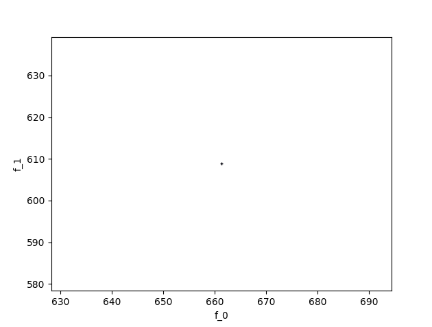

.. _Howto_BF_STREAMS_007:
Howto BF-STREAMS-007: Visualizing Dynamic 2D Random Point Clouds Provided By MLPro
==================================================================================

**Executable code**

.. literalinclude:: ../../../../../../../../../test/howtos/bf/howto_bf_streams_007_native_stream_Clouds2D4C5000Dynamic.py
	:language: python

**Results**

**Cross Reference**
    - :ref:`API Reference: Random Point Clouds <target_api_streams_clouds>`
    - :ref:`API Reference: Streams <target_ap_bf_streams>`
