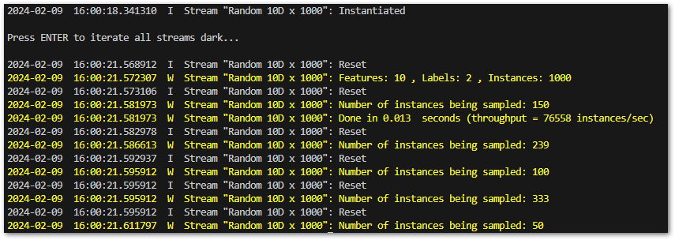

.. _Howto_BF_STREAMS_020:
Howto BF-STREAMS-020: Streams Sampler
=====================================

**Executable code**

.. literalinclude:: ../../../../../../../../../test/howtos/bf/howto_bf_streams_020_sampler.py
	:language: python

**Results**

**Cross Reference**
    - :ref:`API Reference: Random Samplers <ap2_samplers>`
    - :ref:`API Reference: Data from CSV files <target_api_streams_csv_files>`
