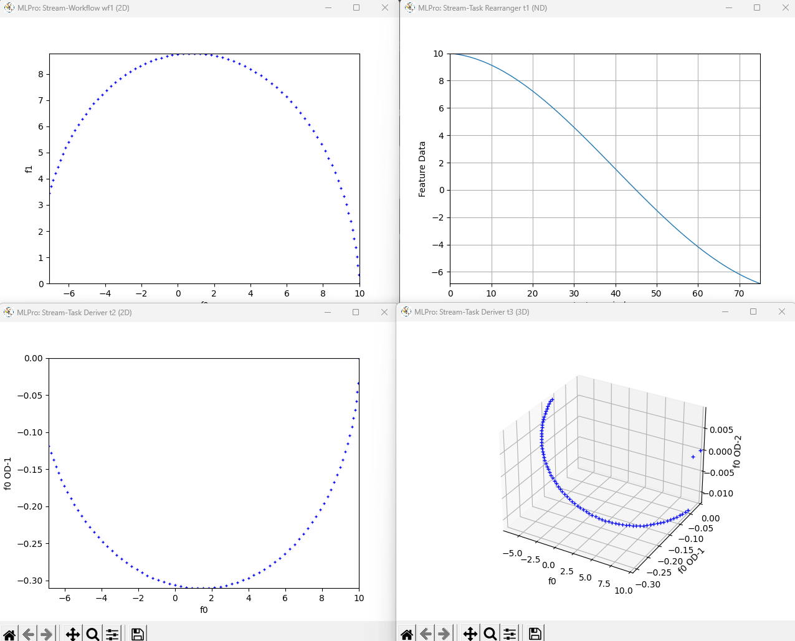

.. _Howto BF STREAMS 131:
Howto BF-STREAMS-131: Deriver
=============================

**Prerequisites**

Please install the following packages to run this example properly:

    - `Matplotlib <https://pypi.org/project/matplotlib/>`_
    - `Tkinter <https://pypi.org/project/tk/>`_

**Executable code**

.. literalinclude:: ../../../../../../../../../test/howtos/bf/howto_bf_streams_131_stream_task_deriver.py
	:language: python

**Results**

**Cross Reference**

    - :ref:`API Reference: Deriver <target_ap_bf_streams>`