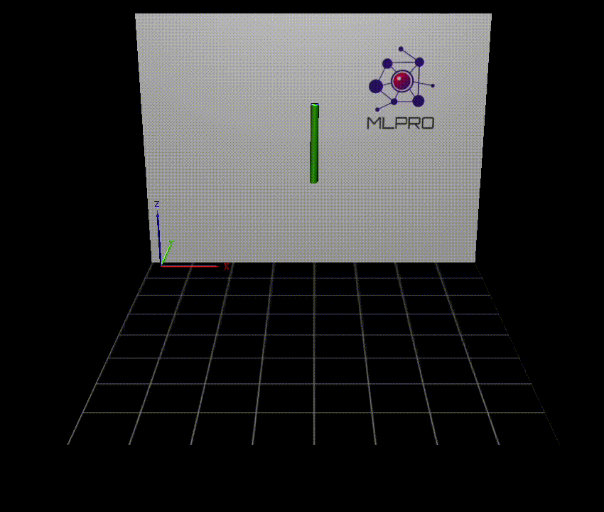

.. _Howto BF SYSTEMS 011:
Howto BF-SYSTEMS-011: Double Pendulum Systems wrapped with MuJoCo
====================================================================

**Prerequisites**

Please install the following packages to run this examples properly:

    - `MuJoCo <https://pypi.org/project/mujoco/>`_
    - `lxml <https://pypi.org/project/lxml/>`_
    - `glfw <https://pypi.org/project/glfw/>`_

**Executable code**

.. literalinclude:: ../../../../../../../../../test/howtos/bf/howto_bf_systems_002_doublependulum_systems_wrapped_with_mujoco.py
	:language: python

**Results**

The MuJoCo windows appears and shows the simulation of a pendulum system.

**Cross Reference**

    - :ref:`API Reference: Systems <target_ap_bf_systems>`