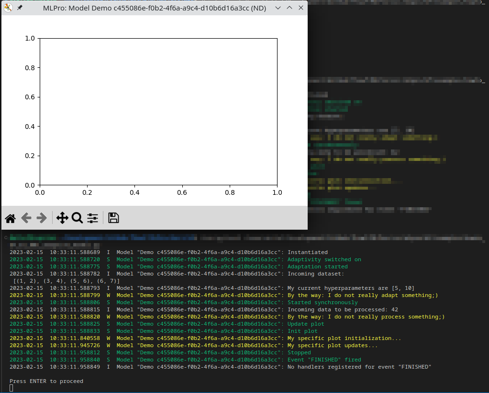

.. _Howto BF ML 001:
Howto BF-ML-001: Adaptive Model
===============================

Executable code
^^^^^^^^^^^^^^^

.. literalinclude:: ../../../../../../../../../src/mlpro/bf/examples/howto_bf_ml_001_adaptive_model.py
	:language: python

Results
^^^^^^^

As shown below, the howto logs all steps and a demo window for visualization appears...

    

Cross Reference
^^^^^^^^^^^^^^^

    - :ref:`API Reference: Machine Learning <target_api_bf_ml>`